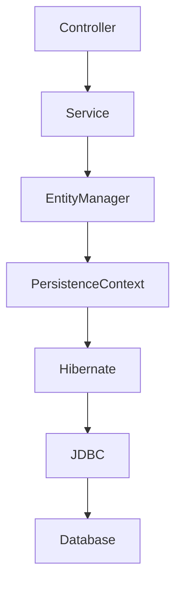
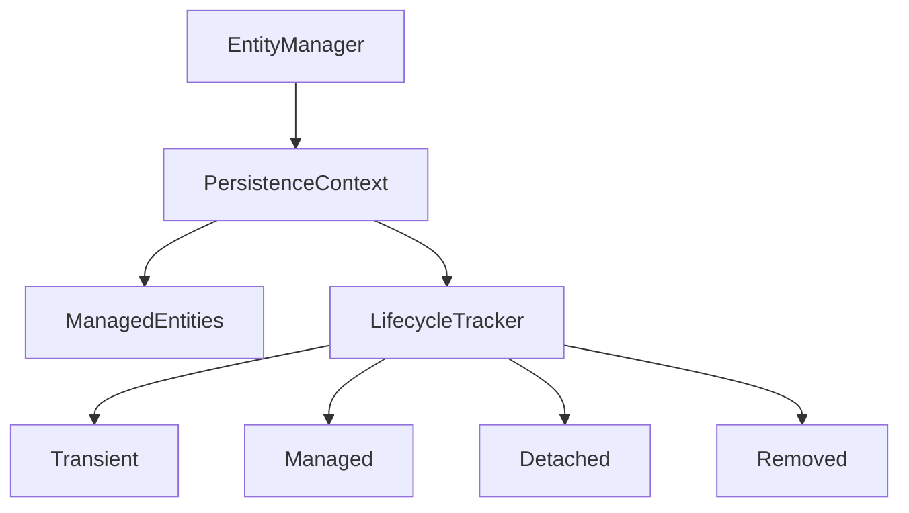
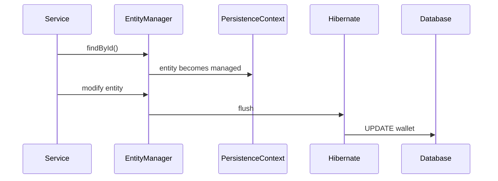
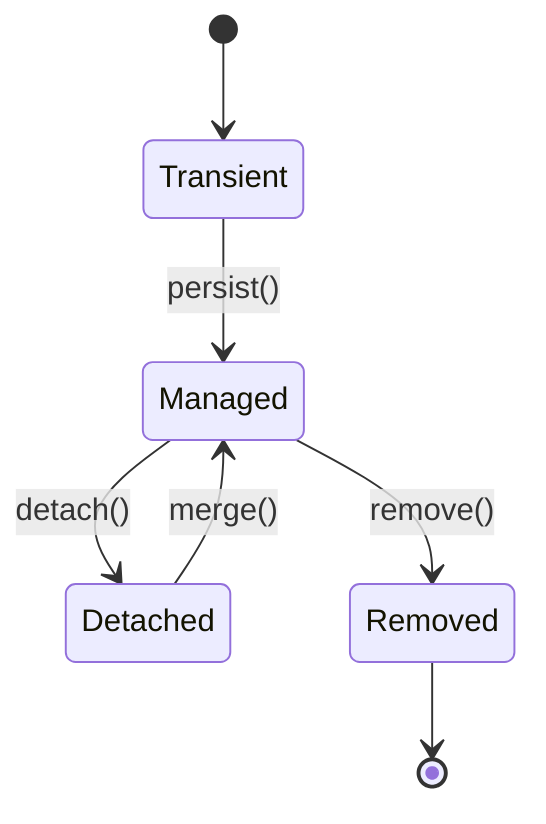
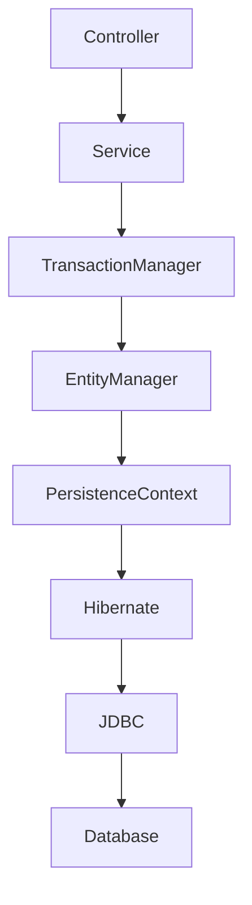
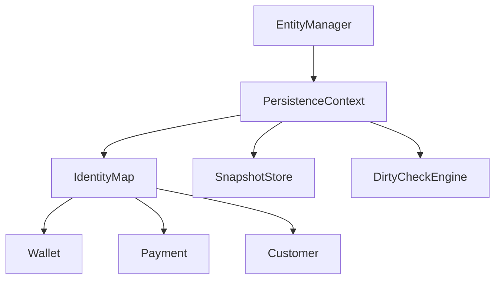
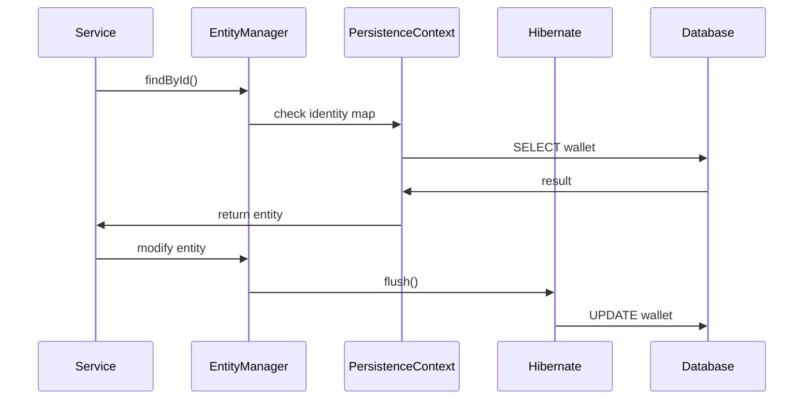
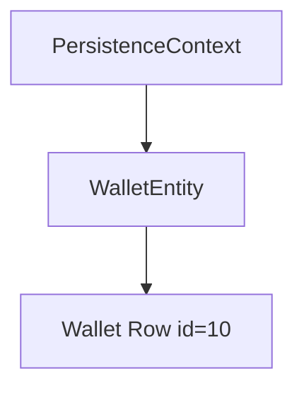

```
What
Why
When
Where
How
Architecture Diagram
Scenario
Goal
What Can Go Wrong
Why It Fails
Correct Approach
Key Principles
Correct Implementation
Execution Flow
Common Mistakes
Best Practices
Decision Matrix
```

We will start with the **FIRST subtopic only**:

# Subtopic 1

# Entity Lifecycle

(From your module: *Entity lifecycle, persistence context, dirty checking, flush vs commit, Hibernate vs JPA behavioral differences*)

---

# Entity Lifecycle

---

# 1. What

Entity Lifecycle describes the **different states a JPA entity goes through during its interaction with the persistence layer**.

In JPA/Hibernate, an entity moves through **four primary states**:

| State     | Description                                                          |
| --------- | -------------------------------------------------------------------- |
| Transient | Entity created in memory but not associated with persistence context |
| Managed   | Entity tracked by Hibernate persistence context                      |
| Detached  | Entity exists but not tracked anymore                                |
| Removed   | Entity marked for deletion                                           |

Example entity:

```java
@Entity
public class Wallet {

    @Id
    @GeneratedValue
    private Long id;

    private BigDecimal balance;
}
```

Lifecycle states determine **whether Hibernate tracks and synchronizes the entity with the database**.

---

# 2. Why

Entity lifecycle exists to allow Hibernate to **automatically synchronize object changes with database rows**.

Without lifecycle tracking developers would manually write:

```
SELECT
UPDATE
DELETE
```

for every operation.

Instead Hibernate tracks entities through lifecycle states and automatically generates SQL.

Example:

```java
wallet.setBalance(BigDecimal.valueOf(5000));
```

Hibernate detects the change and generates:

```sql
UPDATE wallet SET balance = 5000 WHERE id = ?
```

This mechanism reduces:

* SQL boilerplate
* synchronization bugs
* transaction inconsistencies

---

# 3. When

Entity lifecycle transitions occur during common persistence operations.

### Entity Creation

```
Wallet wallet = new Wallet();
```

State:

```
Transient
```

---

### Persisting Entity

```java
entityManager.persist(wallet);
```

State transition:

```
Transient → Managed
```

---

### Detaching Entity

```java
entityManager.detach(wallet);
```

State transition:

```
Managed → Detached
```

---

### Removing Entity

```java
entityManager.remove(wallet);
```

State transition:

```
Managed → Removed
```

---

# 4. Where

Entity lifecycle is managed inside the **Persistence Context**, which is part of the **EntityManager**.

Architecture placement:



The persistence context acts as:

```
First level cache
Entity lifecycle manager
Change tracker
```

---

# 5. How

Lifecycle transitions occur when EntityManager methods are called.

Example:

```java
Wallet wallet = new Wallet();
```

State:

```
Transient
```

After:

```java
entityManager.persist(wallet);
```

Hibernate:

```
Adds entity to persistence context
Assigns ID
Marks entity as managed
```

State:

```
Managed
```

Later:

```java
entityManager.detach(wallet);
```

State:

```
Detached
```

Hibernate stops tracking changes.

---

# 6. Architecture Diagram

Lifecycle management inside persistence context.



---

# 7. Scenario

In SecurePayment Gateway, wallet balance must update after payment.

Flow:

```
Payment success
↓
Wallet balance updated
↓
Database updated
```

Developer code:

```java
public void creditWallet(Long walletId) {

    Wallet wallet = walletRepository.findById(walletId).get();

    wallet.setBalance(wallet.getBalance().add(BigDecimal.valueOf(100)));
}
```

But wallet update does not persist.

---

# 8. Goal

Understand entity lifecycle states so developers can correctly reason about:

* when Hibernate tracks entities
* when SQL is generated
* when updates are ignored

---

# 9. What Can Go Wrong

Updating a **detached entity**.

Example:

```java
Wallet wallet = walletRepository.findById(id).get();

entityManager.detach(wallet);

wallet.setBalance(BigDecimal.valueOf(2000));
```

Expected:

```
UPDATE wallet
```

Actual:

```
No SQL executed
```

---

# 10. Why It Fails

Hibernate only tracks **managed entities**.

When entity becomes detached:

```
Persistence Context stops tracking changes
```

Hibernate cannot detect modifications.

---

# 11. Correct Approach

Always modify entities inside **managed persistence context**.

Use transactional boundary.

```java
@Transactional
public void creditWallet(Long walletId, BigDecimal amount) {

    Wallet wallet = walletRepository.findById(walletId).orElseThrow();

    wallet.setBalance(wallet.getBalance().add(amount));
}
```

Hibernate will automatically update the database.

---

# 12. Key Principles

1. Entities must be **managed** for Hibernate to track changes.
2. Persistence context manages lifecycle.
3. Detached entities are not tracked.
4. Remove operation marks entity for deletion.
5. Lifecycle transitions depend on EntityManager operations.

---

# 13. Correct Implementation

```java
@Service
@RequiredArgsConstructor
public class WalletService {

    private final WalletRepository walletRepository;

    @Transactional
    public void debitWallet(Long walletId, BigDecimal amount) {

        Wallet wallet = walletRepository.findById(walletId)
                .orElseThrow();

        wallet.setBalance(wallet.getBalance().subtract(amount));
    }
}
```

Hibernate generates SQL automatically.

---

# 14. Execution Flow

Lifecycle execution.



---

# 15. Common Mistakes

### Updating Detached Entities

```
wallet.setBalance()
```

after transaction closes.

---

### Manual Save Calls

Developers unnecessarily call:

```
save(entity)
```

for managed entities.

---

### Long Persistence Context

Using extended persistence context causes memory overhead.

---

# 16. Best Practices

Use service-layer transactions.

```
@Transactional
```

Keep transactions short.

Monitor Hibernate metrics.

Enable SQL logging during debugging.

---

# 17. Decision Matrix

| Scenario                           | Recommended Approach     |
| ---------------------------------- | ------------------------ |
| Updating entity inside transaction | Use managed entity       |
| Updating detached entity           | Use merge()              |
| Bulk update                        | Use JPQL update          |
| High concurrency                   | Use optimistic locking   |
| Read-only operations               | Use readOnly transaction |

---

# Entity Lifecycle State Diagram



---
Good 👍
Now we move to the **second subtopic** and apply **exactly the same structure**.

Subtopic 2 from your list:

```
Persistence Context
```

This is one of the **most critical topics for 5+ year engineers**, because many production bugs come from misunderstanding it.

---

# Subtopic 2

# Persistence Context

---

# 1. What

A **Persistence Context** is the **runtime environment where Hibernate manages entity instances**.

It is essentially a **first-level cache + change tracking system** that exists within the **EntityManager**.

It ensures that:

```
One database row
=
One entity instance
```

within a transaction.

Example:

```java
Wallet wallet = entityManager.find(Wallet.class, 10L);
Wallet wallet2 = entityManager.find(Wallet.class, 10L);
```

Both variables reference **the same Java object**.

```
wallet == wallet2  → true
```

This behavior is known as the **Identity Map pattern**.

---

# 2. Why

Persistence Context exists to solve three critical problems:

### 1. Prevent Duplicate Objects

Without a persistence context:

```
SELECT wallet id=10
SELECT wallet id=10
```

would create two different objects.

That breaks consistency.

---

### 2. Enable Dirty Checking

Hibernate must track entity changes.

Persistence Context stores:

```
Entity instance
Snapshot copy
```

so modifications can be detected.

---

### 3. Reduce Database Calls

Example:

```
find wallet
find wallet again
```

Second call is served from **first-level cache**.

No SQL executed.

---

# 3. When

A Persistence Context is created when:

```
Transaction starts
OR
EntityManager is opened
```

Example in Spring:

```java
@Transactional
public void processPayment() {
```

Spring creates:

```
Persistence Context
```

When the method finishes:

```
Transaction commit
↓
Persistence Context closed
```

---

# 4. Where

Persistence Context exists inside **EntityManager**.

Architecture view:



The persistence context lives **within the scope of the transaction**.

---

# 5. How

Internally Hibernate maintains several data structures.

Persistence Context stores:

```
Entity Map
Entity Snapshot Map
Entity State Map
```

Example structure:

```
PersistenceContext
 ├── managedEntities
 ├── entitySnapshots
 └── entityStates
```

Example:

```
Wallet id=10 → Entity instance
Snapshot → balance=1000
```

When the entity changes:

```
balance=1500
```

Hibernate compares snapshot and entity.

---

# 6. Architecture Diagram

Internal persistence context structure.



Components:

| Component        | Purpose                            |
| ---------------- | ---------------------------------- |
| IdentityMap      | ensures single instance per entity |
| SnapshotStore    | stores original entity values      |
| DirtyCheckEngine | detects modifications              |

---

# 7. Scenario

SecurePayment Gateway loads wallet during payment.

```java
Wallet wallet = walletRepository.findById(10L);
```

Later in the same transaction:

```java
Wallet wallet2 = walletRepository.findById(10L);
```

Expected behavior:

```
wallet == wallet2
```

No second SQL query executed.

Persistence context returns cached entity.

---

# 8. Goal

Understand how persistence context ensures:

```
entity identity
change tracking
SQL synchronization
```

so developers avoid issues like:

```
duplicate entity instances
unexpected SQL queries
lost updates
```

---

# 9. What Can Go Wrong

Misunderstanding persistence context scope.

Example:

```java
Wallet wallet = walletRepository.findById(id);
```

Transaction ends.

Later:

```java
wallet.setBalance(BigDecimal.valueOf(2000));
```

Developer expects update.

But entity is **detached**.

---

# 10. Why It Fails

Persistence context closed after transaction.

```
PersistenceContext destroyed
```

Entity becomes:

```
Detached
```

Hibernate no longer tracks changes.

---

# 11. Correct Approach

Always perform entity modifications **inside transactional boundary**.

Example:

```java
@Transactional
public void updateWallet(Long walletId) {

    Wallet wallet = walletRepository.findById(walletId)
        .orElseThrow();

    wallet.setBalance(wallet.getBalance().add(BigDecimal.valueOf(500)));
}
```

Hibernate automatically detects changes.

---

# 12. Key Principles

1️⃣ Persistence Context exists **per transaction**

2️⃣ It acts as **first-level cache**

3️⃣ Only **managed entities are tracked**

4️⃣ Persistence context ensures **entity identity**

5️⃣ It stores **snapshots for dirty checking**

---

# 13. Correct Implementation

```java
@Service
@RequiredArgsConstructor
public class WalletService {

    private final WalletRepository walletRepository;

    @Transactional
    public void addFunds(Long walletId, BigDecimal amount) {

        Wallet wallet = walletRepository.findById(walletId)
                .orElseThrow();

        wallet.setBalance(wallet.getBalance().add(amount));
    }
}
```

Hibernate will execute SQL automatically.

---

# 14. Execution Flow

Persistence context lifecycle.



---

# 15. Common Mistakes

### Assuming EntityManager is Stateless

It actually holds persistence context.

---

### Using Entities Outside Transactions

Detached entities cause silent failures.

---

### Ignoring First-Level Cache

Repeated queries inside same transaction do not hit DB.

---

# 16. Best Practices

Keep persistence context **short-lived**.

Use **service-layer transactions**.

Avoid long-running transactions.

Monitor Hibernate statistics:

```
hibernate.entity.load.count
hibernate.session.open.count
```

---

# 17. Decision Matrix

| Situation                  | Recommended Approach              |
| -------------------------- | --------------------------------- |
| Load entity multiple times | rely on persistence context cache |
| Modify entity              | ensure transaction active         |
| Long processing tasks      | avoid large persistence context   |
| Batch operations           | flush & clear periodically        |

---

# Persistence Context Identity Map



Only **one entity instance exists per row per persistence context**.

---

✅ Now we have covered **Subtopic 2 correctly**.

---

Next subtopics remaining from your list:

```
3️⃣ Dirty Checking
4️⃣ Flush vs Commit
5️⃣ Hibernate vs JPA behavioral differences
```

If you want, I can generate **Subtopic 3 (Dirty Checking)** next — which is actually the **most misunderstood Hibernate mechanism** and needs **internal algorithm diagrams**.


