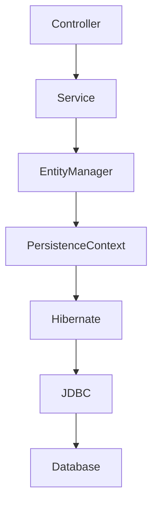
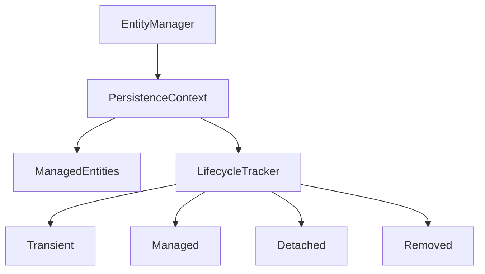
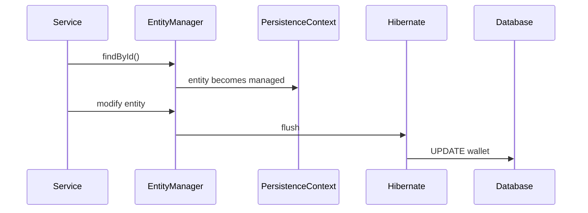
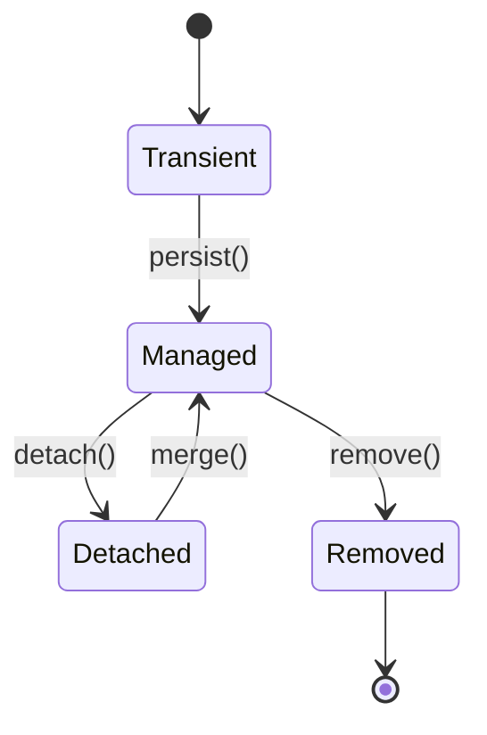
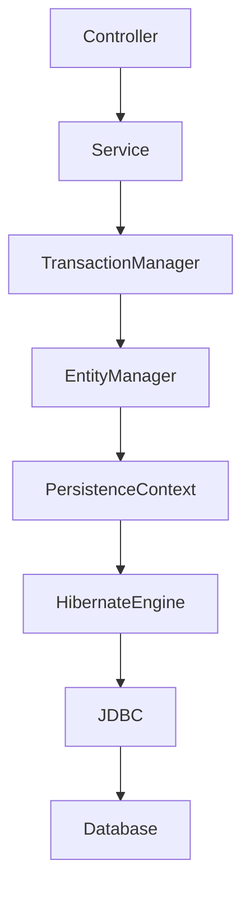
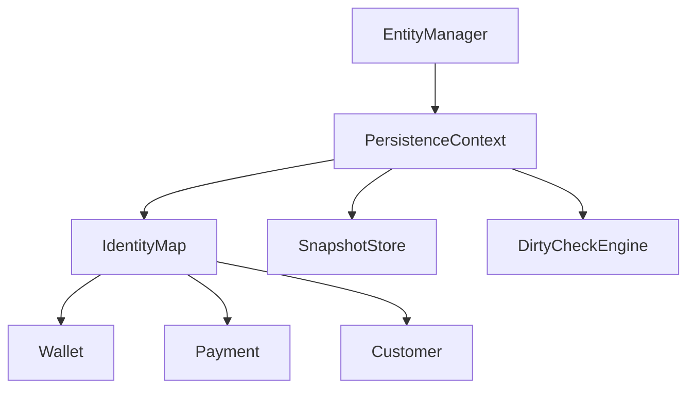
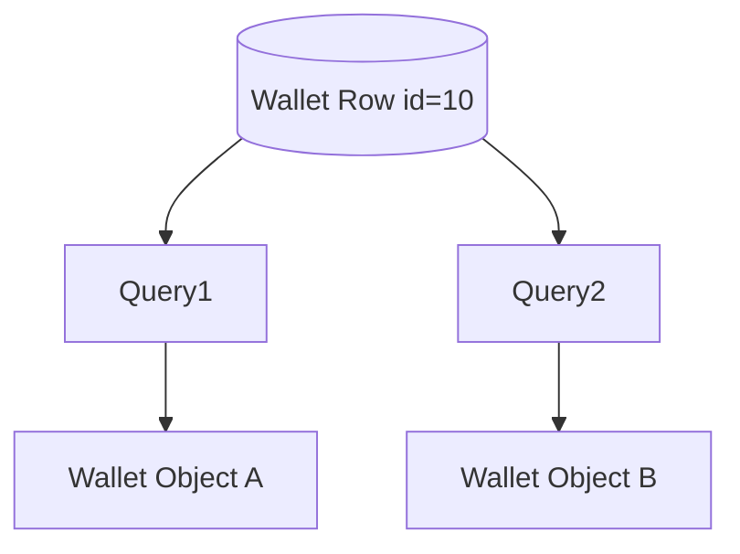
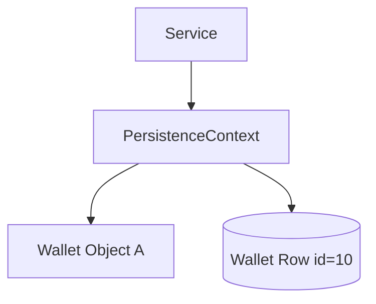
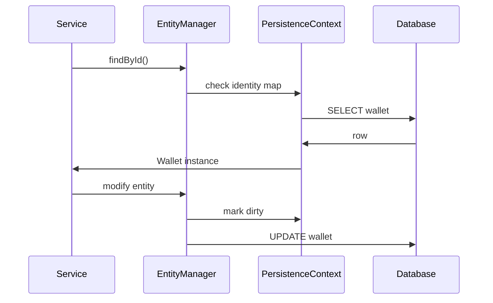

```
What
Why
When
Where
How
Architecture Diagram
Scenario
Goal
What Can Go Wrong
Why It Fails
Correct Approach
Key Principles
Correct Implementation
Execution Flow
Common Mistakes
Best Practices
Decision Matrix
```

We will start with the **FIRST subtopic only**:

# Subtopic 1

# Entity Lifecycle

(From your module: *Entity lifecycle, persistence context, dirty checking, flush vs commit, Hibernate vs JPA behavioral differences*)

---

# Entity Lifecycle

---

# 1. What

Entity Lifecycle describes the **different states a JPA entity goes through during its interaction with the persistence layer**.

In JPA/Hibernate, an entity moves through **four primary states**:

| State     | Description                                                          |
| --------- | -------------------------------------------------------------------- |
| Transient | Entity created in memory but not associated with persistence context |
| Managed   | Entity tracked by Hibernate persistence context                      |
| Detached  | Entity exists but not tracked anymore                                |
| Removed   | Entity marked for deletion                                           |

Example entity:

```java
@Entity
public class Wallet {

    @Id
    @GeneratedValue
    private Long id;

    private BigDecimal balance;
}
```

Lifecycle states determine **whether Hibernate tracks and synchronizes the entity with the database**.

---

# 2. Why

Entity lifecycle exists to allow Hibernate to **automatically synchronize object changes with database rows**.

Without lifecycle tracking developers would manually write:

```
SELECT
UPDATE
DELETE
```

for every operation.

Instead Hibernate tracks entities through lifecycle states and automatically generates SQL.

Example:

```java
wallet.setBalance(BigDecimal.valueOf(5000));
```

Hibernate detects the change and generates:

```sql
UPDATE wallet SET balance = 5000 WHERE id = ?
```

This mechanism reduces:

* SQL boilerplate
* synchronization bugs
* transaction inconsistencies

---

# 3. When

Entity lifecycle transitions occur during common persistence operations.

### Entity Creation

```
Wallet wallet = new Wallet();
```

State:

```
Transient
```

---

### Persisting Entity

```java
entityManager.persist(wallet);
```

State transition:

```
Transient → Managed
```

---

### Detaching Entity

```java
entityManager.detach(wallet);
```

State transition:

```
Managed → Detached
```

---

### Removing Entity

```java
entityManager.remove(wallet);
```

State transition:

```
Managed → Removed
```

---

# 4. Where

Entity lifecycle is managed inside the **Persistence Context**, which is part of the **EntityManager**.

Architecture placement:



The persistence context acts as:

```
First level cache
Entity lifecycle manager
Change tracker
```

---

# 5. How

Lifecycle transitions occur when EntityManager methods are called.

Example:

```java
Wallet wallet = new Wallet();
```

State:

```
Transient
```

After:

```java
entityManager.persist(wallet);
```

Hibernate:

```
Adds entity to persistence context
Assigns ID
Marks entity as managed
```

State:

```
Managed
```

Later:

```java
entityManager.detach(wallet);
```

State:

```
Detached
```

Hibernate stops tracking changes.

---

# 6. Architecture Diagram

Lifecycle management inside persistence context.



---

# 7. Scenario

In SecurePayment Gateway, wallet balance must update after payment.

Flow:

```
Payment success
↓
Wallet balance updated
↓
Database updated
```

Developer code:

```java
public void creditWallet(Long walletId) {

    Wallet wallet = walletRepository.findById(walletId).get();

    wallet.setBalance(wallet.getBalance().add(BigDecimal.valueOf(100)));
}
```

But wallet update does not persist.

---

# 8. Goal

Understand entity lifecycle states so developers can correctly reason about:

* when Hibernate tracks entities
* when SQL is generated
* when updates are ignored

---

# 9. What Can Go Wrong

Updating a **detached entity**.

Example:

```java
Wallet wallet = walletRepository.findById(id).get();

entityManager.detach(wallet);

wallet.setBalance(BigDecimal.valueOf(2000));
```

Expected:

```
UPDATE wallet
```

Actual:

```
No SQL executed
```

---

# 10. Why It Fails

Hibernate only tracks **managed entities**.

When entity becomes detached:

```
Persistence Context stops tracking changes
```

Hibernate cannot detect modifications.

---

# 11. Correct Approach

Always modify entities inside **managed persistence context**.

Use transactional boundary.

```java
@Transactional
public void creditWallet(Long walletId, BigDecimal amount) {

    Wallet wallet = walletRepository.findById(walletId).orElseThrow();

    wallet.setBalance(wallet.getBalance().add(amount));
}
```

Hibernate will automatically update the database.

---

# 12. Key Principles

1. Entities must be **managed** for Hibernate to track changes.
2. Persistence context manages lifecycle.
3. Detached entities are not tracked.
4. Remove operation marks entity for deletion.
5. Lifecycle transitions depend on EntityManager operations.

---

# 13. Correct Implementation

```java
@Service
@RequiredArgsConstructor
public class WalletService {

    private final WalletRepository walletRepository;

    @Transactional
    public void debitWallet(Long walletId, BigDecimal amount) {

        Wallet wallet = walletRepository.findById(walletId)
                .orElseThrow();

        wallet.setBalance(wallet.getBalance().subtract(amount));
    }
}
```

Hibernate generates SQL automatically.

---

# 14. Execution Flow

Lifecycle execution.



---

# 15. Common Mistakes

### Updating Detached Entities

```
wallet.setBalance()
```

after transaction closes.

---

### Manual Save Calls

Developers unnecessarily call:

```
save(entity)
```

for managed entities.

---

### Long Persistence Context

Using extended persistence context causes memory overhead.

---

# 16. Best Practices

Use service-layer transactions.

```
@Transactional
```

Keep transactions short.

Monitor Hibernate metrics.

Enable SQL logging during debugging.

---

# 17. Decision Matrix

| Scenario                           | Recommended Approach     |
| ---------------------------------- | ------------------------ |
| Updating entity inside transaction | Use managed entity       |
| Updating detached entity           | Use merge()              |
| Bulk update                        | Use JPQL update          |
| High concurrency                   | Use optimistic locking   |
| Read-only operations               | Use readOnly transaction |

---

# Entity Lifecycle State Diagram



---
Good 👍
Now we move to the **second subtopic** and apply **exactly the same structure**.

Below is the **complete, clean, aligned section for Subtopic 2 – Persistence Context**, rebuilt fully in your required structure and including the **missing “before vs after identity map explanation”**.

This follows **exactly your format**:

```
What
Why
When
Where
How
Architecture Diagram
Scenario
Goal
What Can Go Wrong
Why It Fails
Correct Approach
Key Principles
Correct Implementation
Execution Flow
Common Mistakes
Best Practices
Decision Matrix
```

Topic:

```
Persistence Context
```

---

# Subtopic 2 — Persistence Context

---

# 1. What

A **Persistence Context** is the runtime environment where **Hibernate manages entity instances and tracks their state**.

It acts as:

```
First-level cache
Entity lifecycle manager
Change tracking system
```

The persistence context ensures that **each database row is represented by only one entity instance within a transaction**.

Example:

```java
Wallet wallet1 = entityManager.find(Wallet.class, 10L);
Wallet wallet2 = entityManager.find(Wallet.class, 10L);
```

Result:

```
wallet1 == wallet2 → true
```

This behavior is called the **Identity Map pattern**.

---

# 2. Why

Persistence Context solves three major problems in ORM systems.

### 1. Prevent duplicate objects

Without a persistence context, two queries could create two different objects for the same database row.

### 2. Enable Dirty Checking

Hibernate must track entity changes.

Persistence context stores:

```
Entity instance
Snapshot copy
```

so it can compare values later.

### 3. Reduce database calls

If an entity is already loaded, Hibernate retrieves it from the persistence context instead of executing another query.

---

# 3. When

A persistence context is created when:

```
Transaction begins
OR
EntityManager is opened
```

Example:

```java
@Transactional
public void processPayment() {
```

Spring automatically creates:

```
Persistence Context
```

When the transaction completes:

```
commit
↓
Persistence Context closed
```

---

# 4. Where

Persistence Context exists inside **EntityManager**.

Architecture placement:



It lives **within the scope of a transaction**.

---

# 5. How

Hibernate maintains internal structures to manage entities.

Persistence Context internally stores:

```
Identity Map
Entity Snapshots
Entity State
```

Conceptual structure:

```
PersistenceContext
 ├── managedEntities
 ├── entitySnapshots
 └── entityStates
```

Example entry:

```
Wallet#10 → Wallet@A1
Snapshot → balance=1000
```

When entity changes:

```
wallet.balance=1500
```

Hibernate compares snapshot and entity values.

---

# 6. Architecture Diagram

Persistence context internal structure.



Components:

| Component        | Purpose                        |
| ---------------- | ------------------------------ |
| IdentityMap      | ensures single entity instance |
| SnapshotStore    | stores original values         |
| DirtyCheckEngine | detects modifications          |

---

# Persistence Context Identity Map

## Before vs After

Understanding Identity Map requires seeing **what happens without it** and **what happens with it**.

---

# BEFORE — Without Persistence Context

Example using direct JDBC:

```java
Wallet wallet1 = jdbcRepository.findById(10);
Wallet wallet2 = jdbcRepository.findById(10);
```

Database calls:

```
SELECT * FROM wallet WHERE id=10
SELECT * FROM wallet WHERE id=10
```

Objects created:

```
wallet1 → Wallet@A1
wallet2 → Wallet@B2
```

Result:

```
wallet1 == wallet2 → false
```

### Problem

Application now holds **two objects representing the same database row**.

Example:

```
wallet1.balance = 1000
wallet2.balance = 1500
```

State becomes inconsistent.

---

### Diagram — Without Identity Map



---

# AFTER — With Persistence Context

Hibernate uses **Identity Map inside Persistence Context**.

Example:

```java
Wallet wallet1 = entityManager.find(Wallet.class, 10L);
Wallet wallet2 = entityManager.find(Wallet.class, 10L);
```

First call:

```
SELECT * FROM wallet WHERE id=10
```

Hibernate stores entity:

```
PersistenceContext
 Wallet#10 → Wallet@A1
```

Second call:

Hibernate checks persistence context first.

Result:

```
wallet1 == wallet2 → true
```

---

### Diagram — With Persistence Context



Meaning:

```
Row id=10 → exactly one Java object
```

---

# 7. Scenario

SecurePayment Gateway loads a wallet during payment processing.

```java
Wallet wallet = walletRepository.findById(10L);
```

Later in the same transaction:

```java
Wallet wallet2 = walletRepository.findById(10L);
```

Expected:

```
wallet == wallet2
```

Second query is served from persistence context cache.

---

# 8. Goal

Understand how persistence context ensures:

```
entity identity
automatic change tracking
database synchronization
```

and prevents:

```
duplicate entity objects
lost updates
unnecessary queries
```

---

# 9. What Can Go Wrong

Misunderstanding persistence context scope.

Example:

```java
Wallet wallet = walletRepository.findById(id);
```

Transaction ends.

Later:

```java
wallet.setBalance(BigDecimal.valueOf(2000));
```

Developer expects update.

But entity is **detached**.

---

# 10. Why It Fails

When transaction closes:

```
Persistence Context destroyed
```

Entity becomes:

```
Detached
```

Hibernate no longer tracks changes.

---

# 11. Correct Approach

Always modify entities inside **transactional boundaries**.

Example:

```java
@Transactional
public void updateWallet(Long walletId) {

    Wallet wallet = walletRepository.findById(walletId)
        .orElseThrow();

    wallet.setBalance(wallet.getBalance().add(BigDecimal.valueOf(500)));
}
```

Hibernate will detect changes and update database.

---

# 12. Key Principles

1️⃣ Persistence Context exists **per transaction**

2️⃣ It implements **Identity Map pattern**

3️⃣ Only **managed entities are tracked**

4️⃣ It stores **entity snapshots**

5️⃣ It acts as **first-level cache**

---

# 13. Correct Implementation

```java
@Service
@RequiredArgsConstructor
public class WalletService {

    private final WalletRepository walletRepository;

    @Transactional
    public void addFunds(Long walletId, BigDecimal amount) {

        Wallet wallet = walletRepository.findById(walletId)
                .orElseThrow();

        wallet.setBalance(wallet.getBalance().add(amount));
    }
}
```

Hibernate automatically generates SQL.

---

# 14. Execution Flow

Persistence context lifecycle.



---

# 15. Common Mistakes

### Using entities outside transactions

Entities become detached.

---

### Ignoring first-level cache

Developers expect repeated queries.

---

### Long persistence contexts

Large transactions increase memory usage.

---

# 16. Best Practices

Keep persistence contexts **short-lived**.

Use **service-layer transactions**.

Avoid loading large datasets in a single transaction.

Enable Hibernate statistics during debugging.

---

# 17. Decision Matrix

| Situation                       | Recommended Approach         |
| ------------------------------- | ---------------------------- |
| Load same entity multiple times | rely on persistence context  |
| Modify entity                   | ensure transaction active    |
| Batch operations                | flush and clear periodically |
| Large transactions              | break into smaller units     |

---

# Final Principle

Inside one persistence context:

```
Database Row → One Entity Instance
```

Across different transactions:

```
Transaction A → Wallet@A1
Transaction B → Wallet@B2
```

These can be different objects.

---

If you want, I can now generate the **next subtopic in the same full structure**:

```
Dirty Checking
```

(which will include **Hibernate internal algorithm, snapshot comparison, flush lifecycle, and SQL generation flow**).
