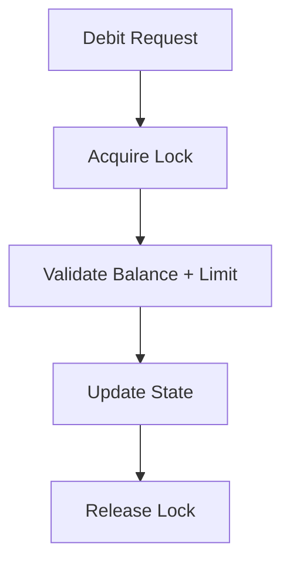
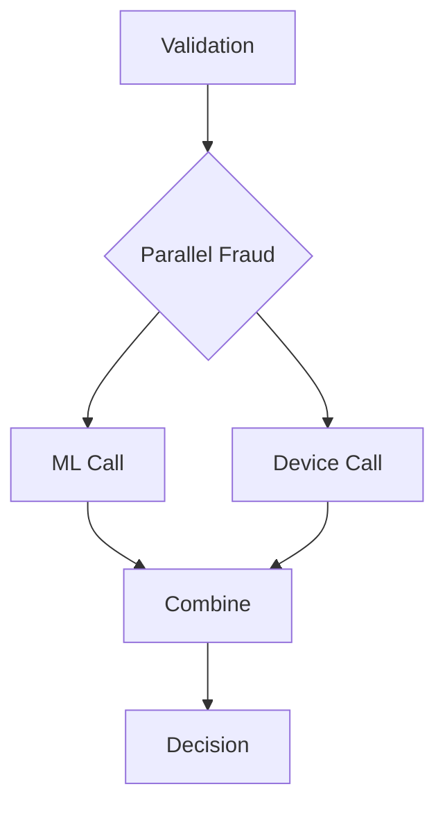
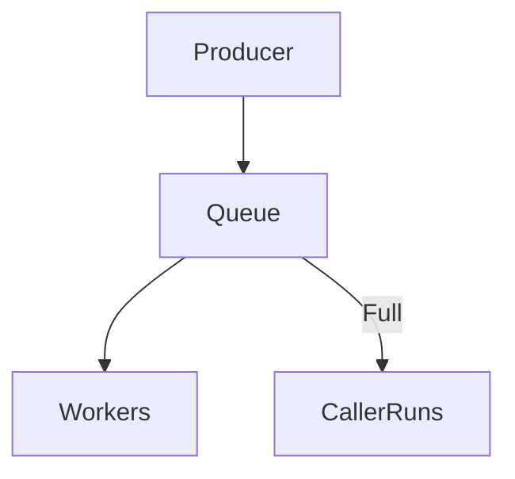
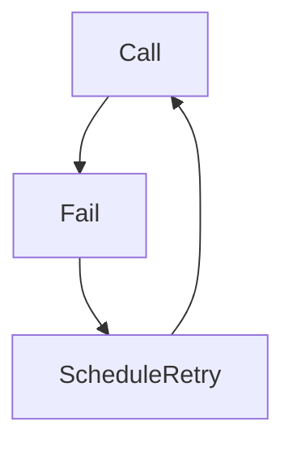
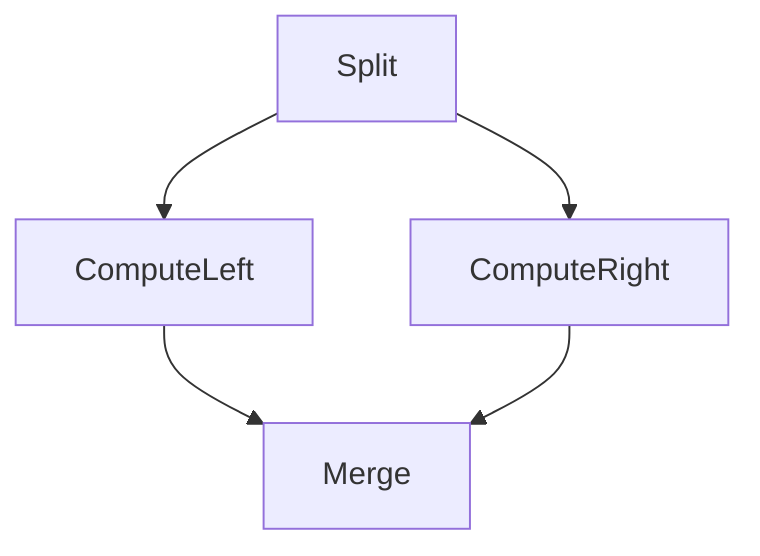
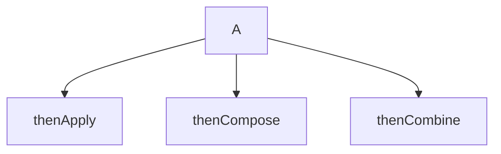
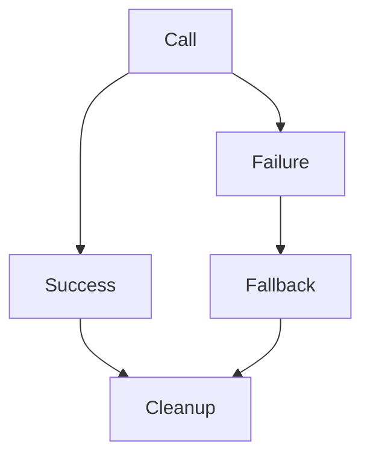
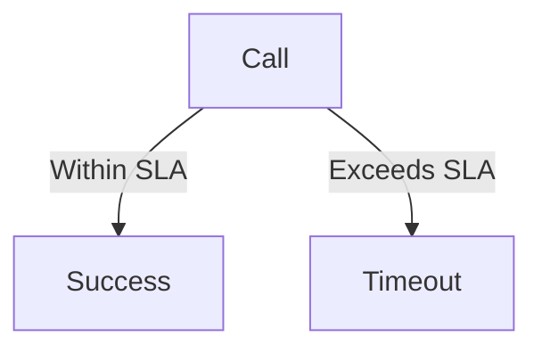
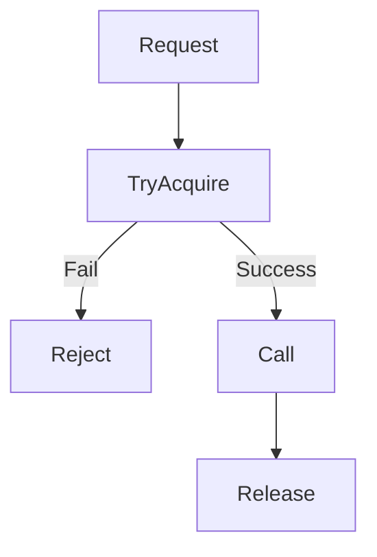

Perfect 👍
Now I’ll apply the **same enterprise format** (concept → scenario → goal → snippet → incorrect → deep explanation → correct → deep explanation → Mermaid workflow → common mistakes → BFSI best practices → Memory & GC → Learning closure mandate)

But as you requested:

> ✅ Try to reduce code length
> ✅ Keep it enterprise-grade
> ✅ Still runnable and production-oriented
> ✅ Mermaid workflows only

I will keep code tight (25–40 lines per section) but still meaningful.

---

# 1️⃣ Concurrent Transaction Validation

---

## Concept (What / Why / When / How / Where in BFSI)

**What:** Protect monetary invariants under concurrent access.
**Why:** Prevent negative balance, limit bypass, reconciliation mismatch.
**When:** UPI debit, wallet deduction, card auth.
**How:** Lock for multi-field invariants, CAS for single-field.
**Where:** Authorization engine, wallet microservice.

---

## Scenario

Two debit requests hit same account concurrently.

---

## Goal

Ensure balance + daily limit update atomically.

---

## Code Snippet (Risk Area)

```java
if(balance >= amt && dailyUsed + amt <= dailyLimit){
    balance -= amt;
    dailyUsed += amt;
}
```

---

## What Can Go Wrong

Race window between check and update.

---

## Incorrect Example

```java
import java.util.concurrent.atomic.AtomicLong;

class BrokenAccount {
    AtomicLong balance = new AtomicLong(1000);
    AtomicLong dailyUsed = new AtomicLong(0);
    long dailyLimit = 1000;

    boolean debit(long amt) {
        if (balance.get() >= amt &&
            dailyUsed.get() + amt <= dailyLimit) {

            balance.addAndGet(-amt);
            dailyUsed.addAndGet(amt);
            return true;
        }
        return false;
    }
}
```

---

## Code Explanation (Incorrect)

* Each field is atomic.
* But invariant spans two fields.
* Two threads pass check simultaneously.
* No atomic grouping.

---

## Correct Approach

Use lock for multi-field invariant.

---

## Correct Implementation

```java
import java.util.concurrent.locks.ReentrantLock;

class SafeAccount {
    long balance = 1000;
    long dailyUsed = 0;
    long dailyLimit = 1000;
    ReentrantLock lock = new ReentrantLock();

    boolean debit(long amt){
        lock.lock();
        try{
            if(balance >= amt && dailyUsed + amt <= dailyLimit){
                balance -= amt;
                dailyUsed += amt;
                return true;
            }
            return false;
        } finally {
            lock.unlock();
        }
    }
}
```

---

## Code Explanation (Correct)

* Lock groups validation + mutation.
* Critical section small.
* No IO inside lock.
* Ensures invariant consistency.

---

## Workflow (Mermaid)



---

## Common Mistakes

* Using AtomicLong for multi-field invariants
* Calling fraud inside lock
* Using double for money

---

## BFSI Best Practices

* Minor currency units (long)
* Idempotency keys
* DB transaction as final guard
* Monitor lock contention

---

## Memory & GC Perspective

* Locking increases thread parking under contention.
* Avoid allocation inside critical section.
* Excessive contention increases context switching cost.

---

## Learning Closure Mandate

Engineers must:

* Understand race conditions
* Understand atomic vs invariant
* Be able to identify race windows in code review

---

# 2️⃣ Async Fraud Checks (CompletableFuture)

---

## Concept

Non-blocking fraud orchestration.

---

## Scenario

ML score + device score must run in parallel.

---

## Goal

Parallel execution without blocking.

---

## Code Snippet

```java
mlF.thenCombine(deviceF, Risk::new)
```

---

## Incorrect Example

```java
import java.util.concurrent.*;

class FraudWrong {

    static ExecutorService pool = Executors.newFixedThreadPool(4);

    static void run(){
        CompletableFuture<Integer> ml =
            CompletableFuture.supplyAsync(() -> slow(), pool);

        int score = ml.join(); // ❌ blocking
        System.out.println(score);
    }

    static int slow(){ sleep(200); return 80; }
    static void sleep(long ms){ try{Thread.sleep(ms);}catch(Exception e){} }
}
```

---

## Code Explanation (Incorrect)

* join() blocks worker thread.
* Pool starvation under load.
* No timeout.

---

## Correct Implementation

```java
import java.util.concurrent.*;
import static java.util.concurrent.TimeUnit.MILLISECONDS;

class FraudCorrect {

    static ExecutorService fraudPool =
        Executors.newFixedThreadPool(6);

    static void run(){
        CompletableFuture<Integer> ml =
            CompletableFuture.supplyAsync(() -> slow(), fraudPool)
                .orTimeout(150, MILLISECONDS)
                .exceptionally(ex -> 40);

        CompletableFuture<Integer> device =
            CompletableFuture.supplyAsync(() -> 20, fraudPool);

        CompletableFuture<Integer> total =
            ml.thenCombine(device, Integer::sum);

        System.out.println(total.join());
    }

    static int slow(){ sleep(200); return 80; }
    static void sleep(long ms){ try{Thread.sleep(ms);}catch(Exception e){} }
}
```

---

## Code Explanation (Correct)

* No blocking inside stage.
* Timeout prevents in-flight buildup.
* Fallback safe.
* Dedicated fraud pool.

---

## Workflow



---

## Memory & GC Perspective

* Each CompletableFuture allocates.
* High TPS → young-gen churn.
* Blocking retains thread stack memory.
* Timeout reduces retention.

---

## Learning Closure Mandate

Engineers must:

* Never block inside async chain
* Understand thread pool starvation
* Understand SLA budgeting

---

# 3️⃣ ExecutorService (Bounded Pool)

---

## Concept

Control backlog and capacity.

---

## Incorrect Example

```java
ExecutorService pool = Executors.newFixedThreadPool(4);
```

Unbounded queue.

---

## Correct Implementation

```java
import java.util.concurrent.*;

class BoundedPool {

    static ExecutorService pool =
        new ThreadPoolExecutor(
            4,4,0L,TimeUnit.MILLISECONDS,
            new ArrayBlockingQueue<>(200),
            new ThreadPoolExecutor.CallerRunsPolicy()
        );
}
```

---

## Workflow



---

## Memory & GC Perspective

* Unbounded queue → OOM.
* Each Runnable holds heap.
* Bounded queue stabilizes GC.

---

## Learning Closure Mandate

Must understand:

* Queue types
* Rejection policies
* Backpressure design

---

# 4️⃣ ScheduledExecutorService (Retry)

---

## Incorrect Example

```java
sleep(500); // ❌ blocks worker
```

---

## Correct Implementation

```java
import java.util.concurrent.*;

class RetryCorrect {

    static ScheduledExecutorService scheduler =
        Executors.newSingleThreadScheduledExecutor();

    static void retry(Runnable task){
        scheduler.schedule(task, 200, TimeUnit.MILLISECONDS);
    }
}
```

---

## Workflow



---

## Memory & GC Perspective

* Infinite retries retain scheduled tasks.
* Cap attempts.
* Cancel unused tasks.

---

## Learning Closure Mandate

Understand:

* Exponential backoff
* Retry cap
* DLQ patterns

---

# 5️⃣ Fork/Join RecursiveTask

---

## Incorrect Example

Shared ConcurrentHashMap aggregation → contention.

---

## Correct Implementation

```java
import java.util.*;
import java.util.concurrent.*;

class SumTask extends RecursiveTask<Long>{

    List<Long> data; int start,end;
    static final int TH=10000;

    SumTask(List<Long>d,int s,int e){
        data=d;start=s;end=e;
    }

    protected Long compute(){
        if(end-start<=TH){
            long sum=0;
            for(int i=start;i<end;i++) sum+=data.get(i);
            return sum;
        }
        int mid=(start+end)/2;
        SumTask left=new SumTask(data,start,mid);
        SumTask right=new SumTask(data,mid,end);
        left.fork();
        return right.compute()+left.join();
    }
}
```

---

## Workflow



---

## Memory & GC Perspective

* Too small threshold → too many task objects.
* Avoid IO in compute().
* Dedicated pool for batch.

---

## Learning Closure Mandate

Understand:

* CPU-bound vs IO-bound
* Work-stealing
* Threshold tuning

---

# 6️⃣ thenApply vs thenCompose vs thenCombine vs allOf

---

## Concept Summary

| Operator    | Use             |
| ----------- | --------------- |
| thenApply   | transform       |
| thenCompose | dependent async |
| thenCombine | parallel merge  |
| allOf       | wait many       |

---

## Workflow



---

## Memory & GC Perspective

* Deep chains increase allocations.
* Avoid nested futures.
* Keep join at boundary.

---

## Learning Closure Mandate

Must:

* Identify nested futures
* Replace blocking joins
* Compose clean pipelines

---

# 7️⃣ Error Handling (exceptionally / handle)

---

## Correct Pattern

```java
future.handle((v,ex)-> ex!=null?fallback:v)
      .whenComplete((r,ex)->cleanup());
```

---

## Workflow



---

## Memory & GC Perspective

* Exceptions allocate stack trace objects.
* Frequent failures increase GC.
* Always cleanup to avoid retention.

---

## Learning Closure Mandate

Understand:

* Difference between exceptionally and handle
* Cleanup placement
* Interrupt restoration

---

# 8️⃣ Timeouts

---

## Correct Pattern

```java
future.orTimeout(150, MILLISECONDS);
```

---

## Workflow



---

## Memory & GC Perspective

* Prevent long-lived futures.
* Reduce retention.
* Stabilize throughput under degradation.

---

## Learning Closure Mandate

Engineers must:

* Budget SLA per dependency
* Understand cascading latency
* Combine timeout + bulkhead

---

# 9️⃣ Rate Limiting (Semaphore Bulkhead)

---

## Correct Implementation

```java
if(!sem.tryAcquire())
    return failedFuture;

return asyncCall()
        .whenComplete((r,ex)->sem.release());
```

---

## Workflow



---

## Memory & GC Perspective

* Blocking acquire retains thread stack.
* Permit leak → system stuck.
* Combine with timeout.

---

## Learning Closure Mandate

Must understand:

* Bulkhead isolation
* Permit lifecycle
* Capacity planning

---

# 🟢 Final Enterprise Closure Mandate

Before production:

* ✔ No blocking inside async
* ✔ Dedicated executors
* ✔ Bounded queues
* ✔ Timeout for all external calls
* ✔ Bulkhead isolation
* ✔ Retry cap
* ✔ GC tested under load
* ✔ Thread dumps reviewed

---

If you want next:

* Add 10 enterprise assignments
* Add 10 refactoring scenarios
* Add 15 incident interview questions
* Add Enterprise Concurrency Maturity Model

Tell me which direction.
