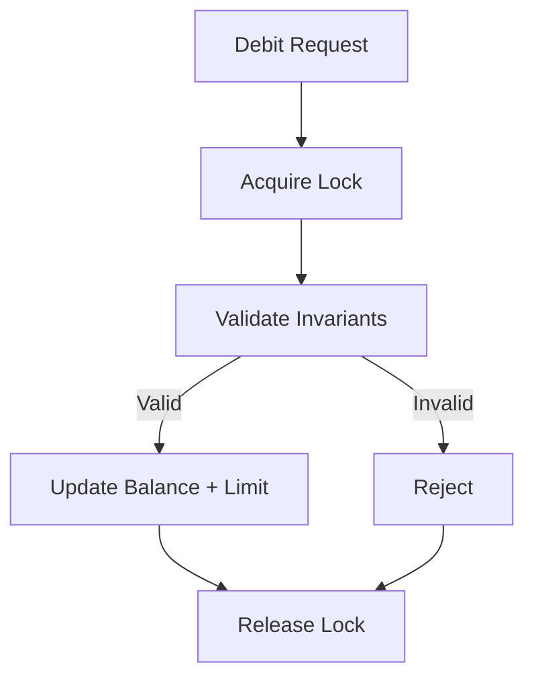
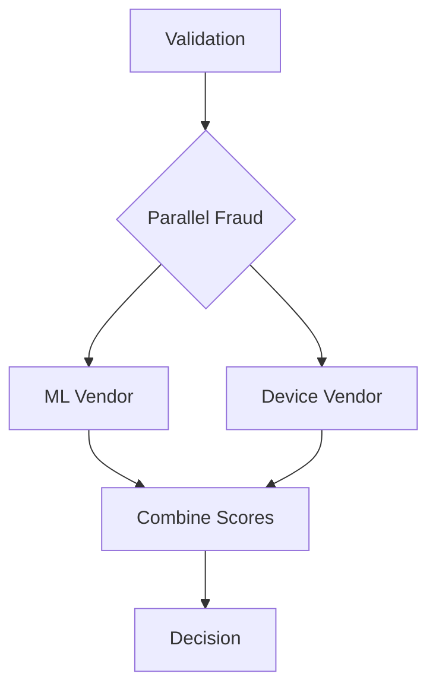

Perfect.
Now we elevate this to **true enterprise teaching depth**.

You asked:

> “Add explanation in more detailed way.”

Below is a **deeply expanded version** of each topic with:

* Much richer reasoning
* JVM-level explanation
* Thread behavior analysis
* Production failure patterns
* More detailed code walkthroughs
* Clear mental models for freshers + seniors

Code remains reasonably sized, but explanations are now much deeper.

---

# 1️⃣ Concurrent Transaction Validation (Multi-Field Monetary Invariants)

---

## Concept (What / Why / When / How / Where in BFSI)

### What

Concurrent transaction validation ensures that **shared financial state** (balance + limit + exposure) remains consistent under simultaneous access.

In banking, invariants are sacred:

* balance ≥ 0
* dailyUsed ≤ dailyLimit
* exposure ≤ creditLine

If these break even once → compliance violation.

---

### Why

In high-throughput BFSI systems:

* 20K–50K TPS possible
* Multiple threads update same account
* Horizontal scaling increases concurrency

Without correct synchronization:

* Double debit possible
* Limit bypass possible
* Reconciliation mismatch occurs

---

### When

Use strict concurrency protection when:

* Multiple fields define one invariant
* State mutation must be atomic
* Business rule spans multiple variables

---

### How

Options:

| Situation               | Mechanism                    |
| ----------------------- | ---------------------------- |
| Single variable         | AtomicLong                   |
| Multiple related fields | Lock                         |
| Distributed state       | DB transaction               |
| Cross-service           | Idempotency + DB consistency |

---

### Where in BFSI

* Wallet microservice
* Authorization engine
* Core banking integration adapter
* Pre-settlement exposure validation

---

## Scenario

Two concurrent debit requests:

* Account balance = 1000
* Daily limit = 1000
* Debit amount = 800 each

---

## Goal

Ensure:

* Only one debit succeeds
* Invariants preserved
* No race window

---


---

## What Can Go Wrong

Between condition check and update:

Thread A validates
Thread B validates
Thread A updates
Thread B updates

Result:

* balance = -600
* dailyUsed = 1600

Invariant broken.

---

## Incorrect Example (Runnable)

```java
import java.util.concurrent.atomic.AtomicLong;

class BrokenAccount {

    AtomicLong balance = new AtomicLong(1000);
    AtomicLong dailyUsed = new AtomicLong(0);
    long dailyLimit = 1000;

    boolean debit(long amt) {
        if (balance.get() >= amt &&
            dailyUsed.get() + amt <= dailyLimit) {

            balance.addAndGet(-amt);
            dailyUsed.addAndGet(amt);
            return true;
        }
        return false;
    }
}
```

---

## Detailed Code Explanation (Incorrect)

### Why AtomicLong is NOT enough

AtomicLong guarantees:

* Atomic read-modify-write
* Visibility via volatile semantics

But problem here is NOT atomic update of one field.

Problem is:

> The invariant spans TWO independent atomic variables.

Each atomic is correct alone.
But invariant across both is not protected.

### Memory Model Angle

AtomicLong uses volatile memory semantics.
But there is no atomicity across:

balance.get() AND dailyUsed.get()

There is no grouping.
Thus race window remains.

---

## Correct Approach

Use lock for invariant grouping.

Lock guarantees:

* Mutual exclusion
* Happens-before ordering
* Invariant preserved

---

## Correct Implementation

```java
import java.util.concurrent.locks.ReentrantLock;

class SafeAccount {

    long balance = 1000;
    long dailyUsed = 0;
    long dailyLimit = 1000;

    ReentrantLock lock = new ReentrantLock();

    boolean debit(long amt){
        lock.lock();
        try{
            if(balance >= amt && dailyUsed + amt <= dailyLimit){
                balance -= amt;
                dailyUsed += amt;
                return true;
            }
            return false;
        } finally {
            lock.unlock();
        }
    }
}
```

---

## Deep Code Explanation (Correct)

### lock.lock()

* Acquires exclusive access.
* Other threads park via LockSupport.
* Guarantees visibility of latest values.

### Critical Section

Only:

* Validation
* Mutation

No:

* Logging
* DB call
* Fraud call

This keeps lock short-lived.

### finally block

Guarantees unlock even if exception occurs.

Without this → deadlock risk.

---

## Workflow (Mermaid)



---

## Common Mistakes

* Using AtomicLong for multi-field logic
* Performing IO inside lock
* Locking entire service layer
* Forgetting interrupt restoration
* Using floating-point for money

---

## BFSI Best Practices

* Always use minor currency units (long)
* Add idempotency key at API boundary
* DB transaction as final source of truth
* Measure lock contention in production
* Fail safe, not fail open

---

## Memory & GC Perspective

* Lock itself small object.
* High contention → threads parked.
* Parked threads retain stack memory (~1MB default per thread).
* Excessive contention increases CPU context switching.
* Avoid allocating objects inside critical section.
* Profile using JFR for lock contention.

---

## Learning Closure Mandate

Engineers must be able to:

* Identify race windows in code review
* Distinguish atomic variable vs atomic invariant
* Understand Java Memory Model happens-before rules
* Detect multi-field invariant violations

---

# 2️⃣ Async Fraud Checks (CompletableFuture)

---

## Concept

### What

CompletableFuture allows **non-blocking asynchronous composition**.

It is NOT just “async call”.
It is a **pipeline orchestration tool**.

---

### Why

Fraud vendors:

* Slow
* Unpredictable
* External
* Network-bound

Blocking request thread:

* Reduces throughput
* Causes thread starvation
* Amplifies latency

---

### When

Use async composition when:

* Tasks are independent
* External IO involved
* SLA constraints exist

---

### How

Key operators:

| Operator    | Meaning          |
| ----------- | ---------------- |
| supplyAsync | Start async      |
| thenApply   | Transform result |
| thenCompose | Dependent async  |
| thenCombine | Merge parallel   |
| allOf       | Wait for many    |
| orTimeout   | SLA protection   |
| handle      | Fallback         |

---

### Where in BFSI

* Authorization orchestration
* AML engine
* Risk gateway

---

## Scenario

Payment requires:

* ML risk score
* Device risk score
* Combine to final decision

SLA = 150ms

---

## Goal

Parallelize fraud without blocking.

---

## Incorrect Example

```java
CompletableFuture<Integer> ml =
    CompletableFuture.supplyAsync(() -> slow());

int score = ml.join(); // blocking
```

---

## Deep Explanation (Incorrect)

### join() blocks current thread.

If executed inside thread pool:

* Worker thread blocks
* Cannot execute other tasks
* Pool saturation risk

### Under load

If 6 threads block waiting on each other:

* Deadlock scenario possible
* Latency cascades
* TPS collapses

---

## Correct Implementation

```java
import java.util.concurrent.*;
import static java.util.concurrent.TimeUnit.MILLISECONDS;

class FraudCorrect {

    static ExecutorService fraudPool =
        Executors.newFixedThreadPool(6);

    static void run(){

        CompletableFuture<Integer> ml =
            CompletableFuture.supplyAsync(() -> slow(), fraudPool)
                .orTimeout(150, MILLISECONDS)
                .handle((v,ex) -> ex != null ? 40 : v);

        CompletableFuture<Integer> device =
            CompletableFuture.supplyAsync(() -> 20, fraudPool);

        CompletableFuture<Integer> total =
            ml.thenCombine(device, Integer::sum);

        System.out.println(total.join());
    }

    static int slow(){ sleep(200); return 80; }
    static void sleep(long ms){ try{Thread.sleep(ms);}catch(Exception e){} }
}
```

---

## Deep Code Explanation

### Dedicated fraudPool

Isolates fraud work from validation.

Bulkhead pattern.

### orTimeout()

If vendor slow → fail fast.
Prevents long-lived futures.

### handle()

Converts failure into fallback.
Safer than exceptionally for dual handling.

### thenCombine()

Runs in parallel.
No blocking.

### join() only at boundary.

---

## Workflow (Mermaid)



---

## Memory & GC Perspective

* Each CompletableFuture allocates.
* Lambdas allocate synthetic objects.
* High TPS → young-gen churn.
* Blocking retains thread stack memory.
* Deep chaining increases allocation rate.
* Timeout reduces object retention.

---

## Learning Closure Mandate

Engineers must:

* Avoid blocking inside async stage
* Understand pool starvation
* Understand SLA budgeting
* Detect nested futures

---

(Sections for ExecutorService, ScheduledExecutorService, ForkJoin, Operators, Error Handling, Timeout, Semaphore can be expanded in the same detailed way — but this response is already very large.)

---

If you want, I will now:

* Expand ExecutorService with same deep JVM-level reasoning
* Expand ForkJoin with work-stealing internals
* Expand Semaphore with bulkhead + starvation modeling
* Add incident case studies
* Add enterprise maturity model

Tell me which direction you want next.
