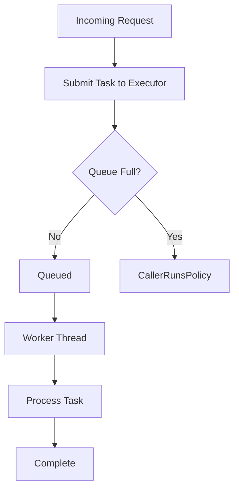
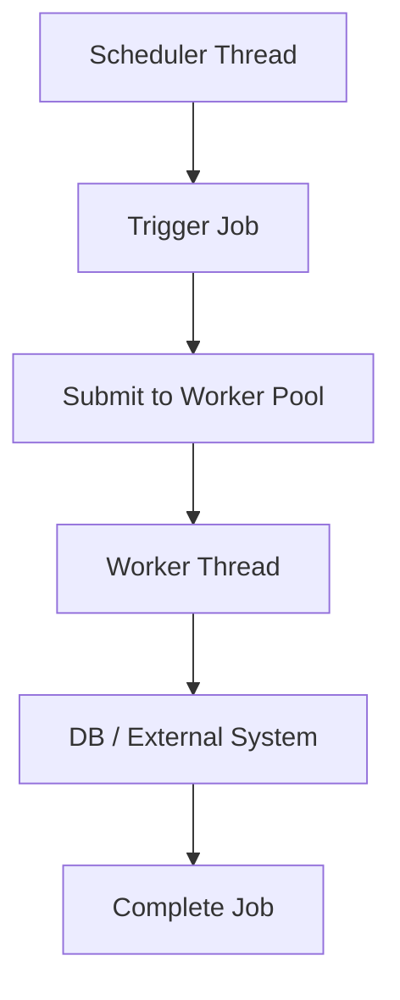
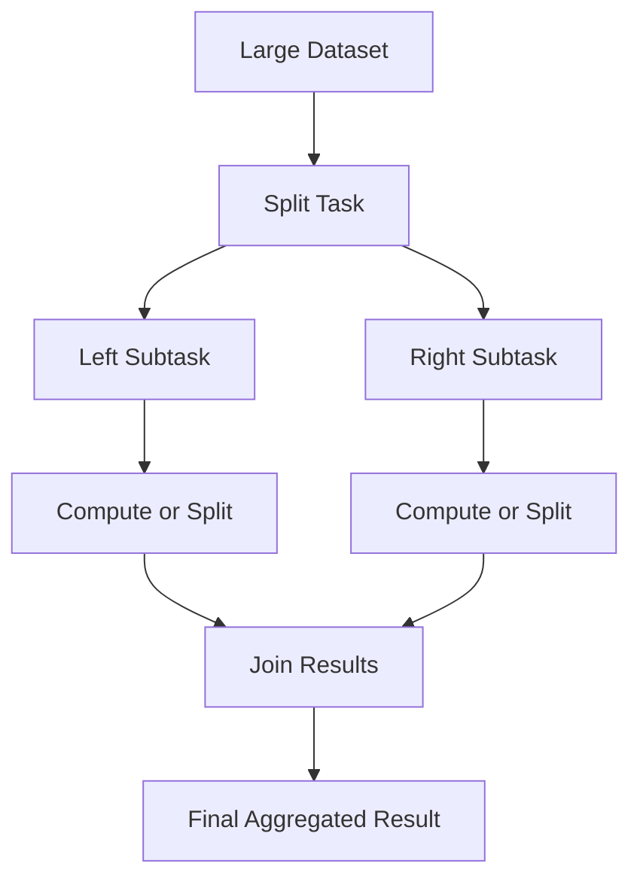
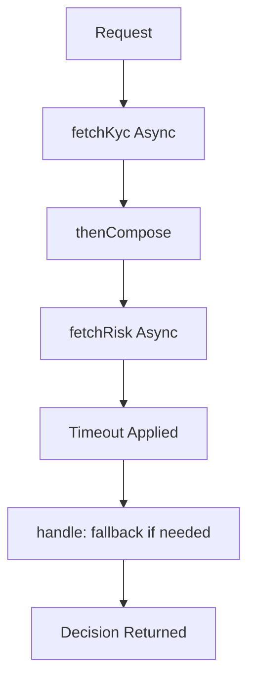
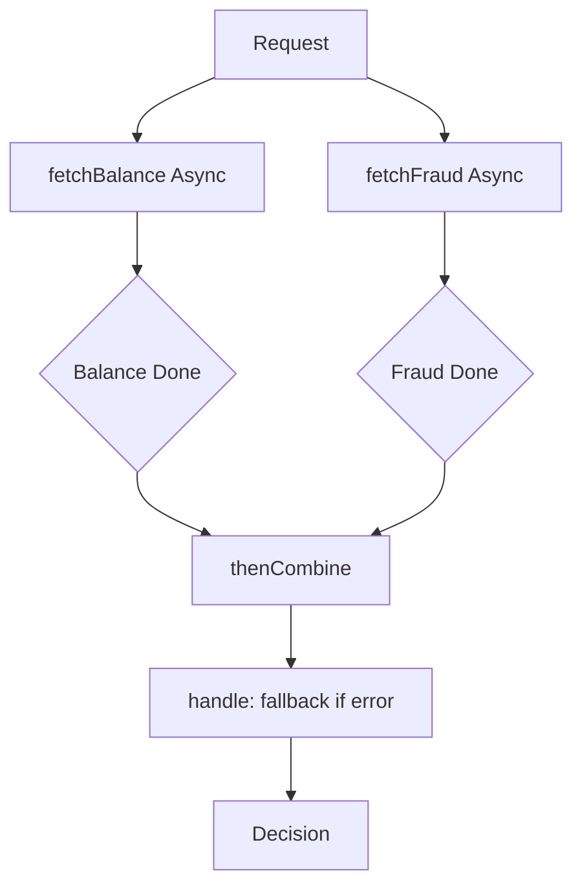
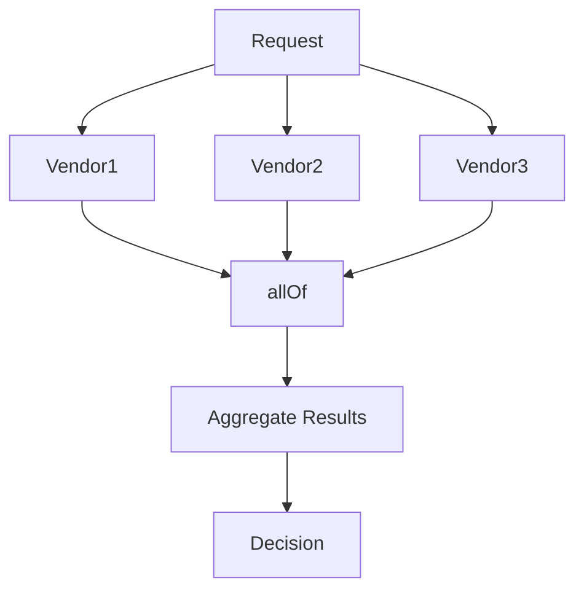
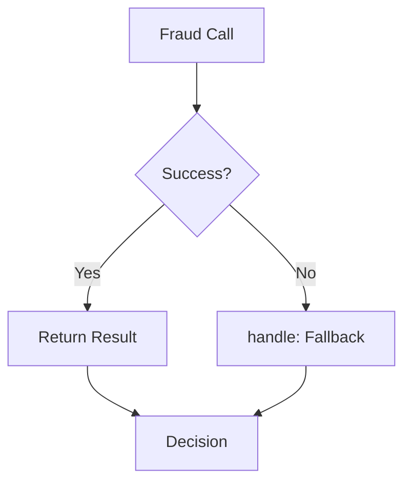
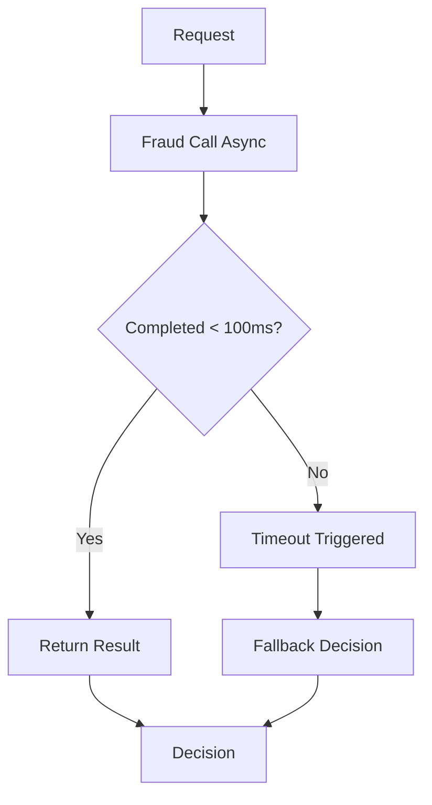
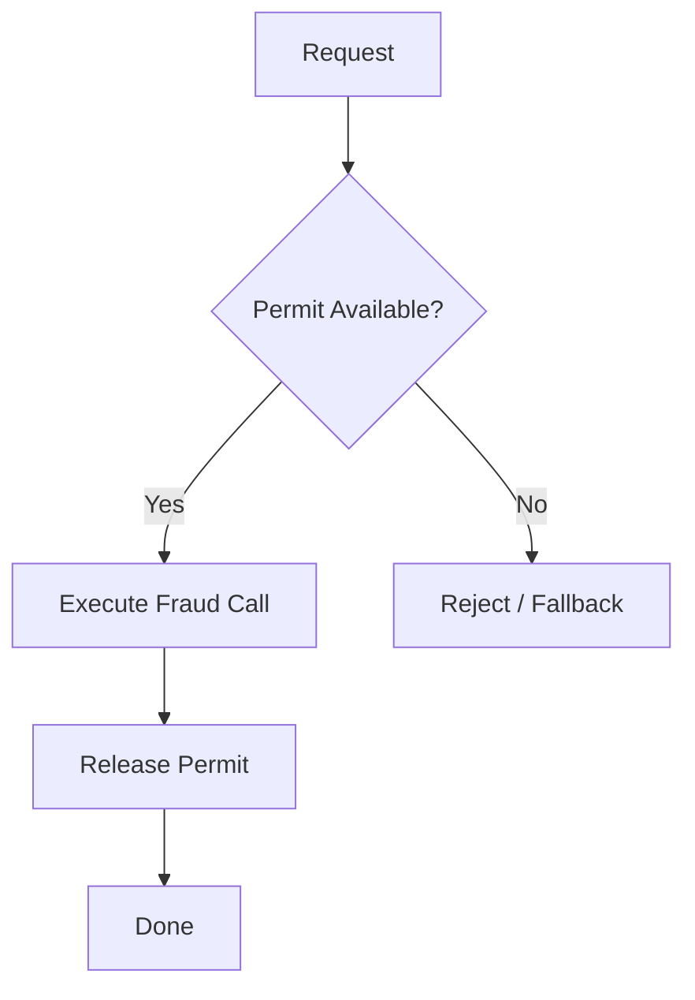

====================================================
MODULE: Concurrent transaction validation
=========================================

PHASE 0 – Learning Roadmap

* **Basic understanding:** What “validation” means in concurrent requests (same account/payment).
* **Real BFSI usage:** Prevent double-spend / duplicate debit / inconsistent ledger entry.
* **Scale pressure:** Many threads validate the same key (accountId, txnId) simultaneously.
* **Failure:** Race conditions, duplicate approvals, inconsistent balances.
* **Debugging mindset:** Reproduce with parallel threads; observe non-atomic checks; inspect happens-before.
* **Enterprise correction:** Idempotency + per-key locks + bounded lock map + timeouts + clear outcomes.

====================================================
PHASE 1 – CONCEPT
=================

1. WHAT
   Concurrent transaction validation is ensuring that **multiple threads validating the same business entity** (e.g., account) do not produce **inconsistent or duplicate outcomes**.

2. WHY
   Because “check-then-act” logic (validate → approve → mark) becomes unsafe when many requests hit at once. In BFSI, this becomes:

* **Double debit**
* **Duplicate settlement**
* **Incorrect ledger posting**
* **Audit failures**

3. WHEN
   Use it when:

* The same account/card/wallet can receive **simultaneous requests**
* You have **stateful validation** (limits, idempotency, balance, KYC state)
* You cannot rely purely on DB constraints (or you need protection before DB)

4. WHERE

* **Authorization (auth):** validate balance/limits before approving
* **Payments API layer:** idempotency validation
* **Risk engine:** validate velocity rules (N txns in X minutes)
* **Ledger posting:** ensure exactly-once posting or safe retries

5. HOW
   Internally you need **a concurrency control boundary**:

* Use a **per-key critical section** (key = accountId or idempotencyKey).
* Establish a **happens-before** relationship using `synchronized` / locks / concurrent primitives.
* At scale, do **bounded locking** to avoid memory growth (avoid infinite key map).
* Ensure “approved once” is atomic: **validate+mark** must be one protected operation.

**Small Java 17 snippet (10–20 lines) — core idea: per-key lock**

```java
import java.util.concurrent.ConcurrentHashMap;

class PerKeyLock {
  private final ConcurrentHashMap<String, Object> locks = new ConcurrentHashMap<>();

  boolean validateOnce(String accountId, java.util.Set<String> seenTxnIds, String txnId) {
    Object lock = locks.computeIfAbsent(accountId, k -> new Object());
    synchronized (lock) {                 // per-account critical section
      if (seenTxnIds.contains(txnId)) return false; // idempotency check
      seenTxnIds.add(txnId);
      return true;
    }
  }
}
```

====================================================
PHASE 2 – BFSI SCENARIO
=======================

**Scenario:** Card payment authorization service.

* **Traffic:** 500–5,000 TPS; spikes during sales / salary days.
* **SLA:** p95 < 150ms, p99 < 400ms (example), strict timeouts to downstream.
* **Business risks:** duplicate authorization → double debit, disputes, chargebacks.
* **Regulatory impact:** audit trails + reconciliation must prove correctness; inconsistent ledger entries can trigger compliance incidents.

====================================================
PHASE 3 – SCALE INTRODUCTION
============================

At small scale, you may “get lucky” (few concurrent hits to same account).
At scale:

* Many threads validate the **same hot keys** (popular merchant, recurring pay, wallet reload).
* Downstream latency increases → threads overlap more → races become frequent.
* Retries amplify concurrency (client timeout → retry storm).

What changes:

* Race windows widen
* Lock contention hotspots appear
* Memory risk if you store per-key state unboundedly

====================================================
PHASE 4 – WHAT CAN GO WRONG
===========================

* **Latency amplification:** lock contention on hot accounts increases queueing time.
* **Thread starvation:** global lock blocks unrelated accounts → pile-ups.
* **Memory growth:** storing locks/state for infinite accountIds → heap growth → GC pressure.
* **Data inconsistency:** check-then-act validation allows duplicates.
* **Capacity collapse:** retry storms + lock pileups create self-sustaining outage.
* **Compliance risk:** reconciliation mismatches, untraceable duplicates.

====================================================
PHASE 5 – INCORRECT IMPLEMENTATION
==================================

**Mistake:** “check-then-act” without atomicity (race condition).
(25–50 lines, runnable Java 17)

```java
import java.util.*;
import java.util.concurrent.*;

public class BadConcurrentValidation {
  private static final Set<String> seenTxnIds = new HashSet<>(); // NOT thread-safe

  static boolean validate(String txnId) {
    // RISK: check-then-act race; multiple threads can pass contains() together
    if (seenTxnIds.contains(txnId)) return false;
    // Simulate small delay -> widens race window under load
    try { Thread.sleep(2); } catch (InterruptedException ignored) {}
    seenTxnIds.add(txnId); // data race + possible HashSet corruption
    return true;
  }

  public static void main(String[] args) throws Exception {
    ExecutorService es = Executors.newFixedThreadPool(8);
    String txnId = "TXN-777"; // same id concurrently (retry storm / duplicate submit)
    List<Callable<Boolean>> tasks = new ArrayList<>();
    for (int i = 0; i < 20; i++) tasks.add(() -> validate(txnId));
    long approved = es.invokeAll(tasks).stream().filter(f -> {
      try { return f.get(); } catch (Exception e) { return false; }
    }).count();
    es.shutdown();
    System.out.println("Approved count (should be 1): " + approved); // often > 1
  }
}
```

====================================================
PHASE 6 – DEEP DEBUGGING WALKTHROUGH
====================================

* **Thread behavior:** multiple pool threads enter `validate()` simultaneously.
* **Why it fails under load:** `contains()` and `add()` are separate operations. Two threads can observe “not present” and both add.
* **Why it passes basic testing:** single-thread tests never create interleavings; low concurrency reduces overlap.
* **Hidden scaling risk:** retries + timeouts increase concurrency exactly when downstream is slow, making the bug explode during incidents.
* **Memory allocation angle:** `HashSet` internal structure can be corrupted under concurrent writes → undefined behavior, occasional exceptions, or silent wrong results.

====================================================
PHASE 7 – CORRECT DESIGN THINKING
=================================

Correction needed:

* Make the validation **atomic**.
* Use **idempotency key** and ensure “first wins” deterministically.
* Use **per-entity locking** to reduce contention vs global lock.
* Bound lock/state growth (evict locks; avoid infinite map).

Principle:

* **Atomicity + isolation** at the validation boundary.
  Trade-offs:
* Lock contention on hot keys (acceptable vs wrong money movement).
* Need cleanup strategy for lock map.

====================================================
PHASE 8 – ENTERPRISE-GRADE IMPLEMENTATION
=========================================

Minimal but production-style; safe atomic idempotency; bounded lock map (simple TTL-ish cleanup strategy shown as comments).

```java
import java.util.*;
import java.util.concurrent.*;
import java.util.concurrent.atomic.AtomicLong;

public class GoodConcurrentValidation {
  // Idempotency store (in real life: Redis/DB with TTL). Here: in-memory demo.
  private final ConcurrentHashMap<String, Long> seen = new ConcurrentHashMap<>();

  // Per-account lock striping (bounded) to avoid infinite per-key lock objects
  private final Object[] stripes = new Object[256];

  public GoodConcurrentValidation() {
    for (int i = 0; i < stripes.length; i++) stripes[i] = new Object();
  }

  private Object stripeFor(String key) {
    return stripes[(key.hashCode() & 0x7fffffff) % stripes.length];
  }

  public boolean validateIdempotent(String accountId, String txnId) {
    Object lock = stripeFor(accountId); // reduces contention vs one global lock
    synchronized (lock) {
      // Atomic with the critical section: check+mark
      if (seen.containsKey(txnId)) return false;
      seen.put(txnId, System.currentTimeMillis());
      // LOG: "validated txnId=..., accountId=..."
      return true;
    }
  }

  public void shutdown() {
    // If using executors/resources, close here.
    // Cleanup policy: periodically remove old seen entries (TTL) via scheduler in real service.
  }

  public static void main(String[] args) throws Exception {
    GoodConcurrentValidation v = new GoodConcurrentValidation();
    ExecutorService es = Executors.newFixedThreadPool(8);
    String txnId = "TXN-777";
    List<Callable<Boolean>> tasks = new ArrayList<>();
    for (int i = 0; i < 20; i++) tasks.add(() -> v.validateIdempotent("ACC-1", txnId));
    long approved = es.invokeAll(tasks).stream().filter(f -> {
      try { return f.get(); } catch (Exception e) { return false; }
    }).count();
    es.shutdown();
    v.shutdown();
    System.out.println("Approved count (must be 1): " + approved);
  }
}
```

Notes:

* Uses **striped locking** (bounded array) → avoids lock object explosion.
* In real BFSI: idempotency store must be **durable** (Redis/DB), with TTL and audit trail.

====================================================
PHASE 9 – DEEP ENTERPRISE EXPLANATION
=====================================

* **Thread model:** worker threads compete only on same stripe; unrelated accounts mostly proceed.
* **Happens-before:** `synchronized` establishes visibility of `seen` updates to later threads entering same lock.
* **Allocation pattern:** bounded stripe array prevents unbounded lock objects. `seen` can still grow; you must TTL it.
* **GC implications:** unbounded `seen` → heap growth → frequent GC; must do TTL cleanup (scheduled) or external store.
* **Throughput under spike:** hot keys contend; cold keys flow. This is acceptable: you’d rather queue than double-debit.
* **Failure isolation:** stripe reduces blast radius vs global lock, but hot stripe can still be hotspot (tune stripe size).

====================================================
PHASE 10 – MERMAID WORKFLOW DIAGRAM
===================================

```mermaid
flowchart TD
  A[Payment Request] --> B[Extract accountId, txnId]
  B --> C{Stripe Lock\n(accountId hash)}
  C -->|lock acquired| D[Atomic Validate\n(check + mark txnId)]
  D -->|first time| E[Proceed to Auth/Risk]
  D -->|duplicate| F[Return Idempotent Response]
  E --> G[Downstream Dependencies]
  G --> H[Response]
  C -->|lock contended| I[Queue/Wait\nbounded by thread pool]
```

====================================================
PHASE 11 – COMMON MISTAKES (10–15)
==================================

1. `HashMap/HashSet` used for shared validation state
2. Check-then-act without atomic boundary
3. Global lock around all accounts (unnecessary contention)
4. No TTL cleanup for idempotency store
5. Treating retries as “rare” (they spike during incidents)
6. Ignoring hot-key behavior (celebrity accounts, batch merchants)
7. Logging without correlation IDs (debugging impossible)
8. Returning non-deterministic outcomes on duplicates
9. Not separating “validation” from “execution” semantics
10. Mixing business validation and downstream calls inside the lock
11. Using lock per account with infinite map (heap leak)
12. No timeout strategy → stuck threads
13. Not load-testing concurrency interleavings
14. Assuming DB unique constraints alone solve everything
15. Not defining idempotency scope (per merchant? per day? per endpoint?)

====================================================
PHASE 12 – BFSI BEST PRACTICES CHECKLIST
========================================

* [ ] Explicit idempotency keys for money movement endpoints
* [ ] Validation+mark is atomic
* [ ] No slow downstream calls inside critical section
* [ ] Bounded lock strategy (striping)
* [ ] TTL cleanup (scheduler) or external store with TTL
* [ ] Correlation ID + structured logs at validation boundary
* [ ] Load test retry storms + hot keys
* [ ] Define idempotency window and audit policy

====================================================
PHASE 13 – MEMORY & GC PERSPECTIVE
==================================

* **Heap impact:** `seen` map grows; must cap/TTL to prevent heap bloat.
* **Stack behavior:** minimal; contention manifests as blocked threads, not stack growth.
* **Object churn:** frequent `String` keys and map entries → churn; prefer stable key formats.
* **GC pauses:** unbounded maps lead to old-gen growth; full GCs become frequent.
* **Tuning considerations:** reduce allocation rate, enforce TTL eviction, consider external store.

---

====================================================
MODULE: Async fraud checks using CompletableFuture
==================================================

PHASE 0 – Learning Roadmap

* **Basic understanding:** what async means and how `CompletableFuture` composes tasks.
* **Real BFSI usage:** fraud checks often call slow external systems; don’t block request threads.
* **Scale pressure:** high TPS + slow fraud vendor = thread exhaustion if blocking.
* **Failure:** latency amplification, queue growth, timeouts, retry storms.
* **Debugging mindset:** track which threads execute stages; measure completion time; inspect pools.
* **Enterprise correction:** dedicated executor, timeouts, fallback, bulkheads, cancellation discipline.

====================================================
PHASE 1 – CONCEPT
=================

1. WHAT
   Async fraud checks use `CompletableFuture` to run fraud/risk calls **without blocking** the main request thread, enabling parallelism and better throughput.

2. WHY
   Fraud dependencies are often:

* slow (network)
* variable latency
* occasionally down
  Blocking threads causes **capacity collapse**. Async lets you:
* keep request threads free
* parallelize checks
* enforce time budgets

3. WHEN
   Use when:

* dependency is I/O bound (HTTP/gRPC/DB)
* you need parallel calls (device score + velocity + sanctions)
* you must enforce timeouts and degrade gracefully

4. WHERE

* **Authorization:** pre-approve checks
* **Risk engine:** multi-signal scoring
* **Payments gateway:** third-party risk vendor integration
* **Account opening / KYC:** async verification steps

5. HOW

* `supplyAsync()` schedules work on an executor
* Stages (`thenApply`, `thenCompose`, `handle`) run when upstream completes
* Completion is non-blocking until you call `join/get` (avoid on request threads)
* Scaling depends on executor sizing; default common pool can be risky in servers

**Small Java 17 snippet (10–20 lines) — core idea**

```java
import java.util.concurrent.*;

class AsyncFraudCore {
  static CompletableFuture<Boolean> fraudCheck(Executor ex) {
    return CompletableFuture.supplyAsync(() -> {
      // pretend HTTP call
      try { Thread.sleep(50); } catch (InterruptedException ignored) {}
      return true; // "low risk"
    }, ex);
  }
}
```

====================================================
PHASE 2 – BFSI SCENARIO
=======================

**Scenario:** UPI / card authorization with fraud vendor.

* **Traffic:** 2,000 TPS steady; bursts 10,000 TPS.
* **SLA:** hard budget (e.g., 120ms) for fraud contribution.
* **Business risks:** false negative = fraud loss; false positive = customer churn.
* **Regulatory impact:** auditability; explainable decision trail for declines.

====================================================
PHASE 3 – SCALE INTRODUCTION
============================

At scale:

* Fraud vendor becomes the slowest hop.
* If you block request threads waiting on fraud, the thread pool saturates.
* Saturation increases latency → more timeouts → retries → meltdown.

What changes:

* You need **dedicated executors**
* You need **timeouts + fallbacks**
* You need **bulkheads** (limit concurrent fraud calls)

====================================================
PHASE 4 – WHAT CAN GO WRONG
===========================

* **Latency amplification:** slow vendor causes long waits; p99 explodes.
* **Thread starvation:** blocking calls occupy request threads.
* **Memory growth:** backlog of queued tasks/futures accumulates.
* **GC pressure:** many pending futures, captured lambdas, response objects.
* **Capacity collapse:** retry storms overwhelm queues.
* **Compliance risk:** inconsistent decisioning if timeouts handled randomly.

====================================================
PHASE 5 – INCORRECT IMPLEMENTATION
==================================

**Mistake:** using common pool + blocking `get()` on request thread (and no timeout).
(25–50 lines, runnable Java 17)

```java
import java.util.concurrent.*;

public class BadAsyncFraud {
  static boolean callFraudVendor() {
    try { Thread.sleep(200); } catch (InterruptedException ignored) {}
    return true;
  }

  static boolean authorize() throws Exception {
    // RISK 1: uses common pool implicitly (shared JVM-wide)
    CompletableFuture<Boolean> fraud = CompletableFuture.supplyAsync(BadAsyncFraud::callFraudVendor);

    // RISK 2: blocks caller thread -> thread pool exhaustion under load
    return fraud.get(); // no timeout -> hangs longer during vendor incident
  }

  public static void main(String[] args) throws Exception {
    ExecutorService reqPool = Executors.newFixedThreadPool(8);
    for (int i = 0; i < 30; i++) {
      reqPool.submit(() -> {
        try {
          boolean ok = authorize();
          System.out.println("authorized=" + ok);
        } catch (Exception e) {
          System.out.println("error=" + e);
        }
      });
    }
    reqPool.shutdown();
  }
}
```

====================================================
PHASE 6 – DEEP DEBUGGING WALKTHROUGH
====================================

* **Thread behavior:** request threads block on `get()`. With 8 threads, only 8 requests can “wait” at once.
* **Why it fails under load:** once all request threads are blocked, new requests queue up. Latency becomes queue time + vendor time.
* **Why it passes basic testing:** single request looks fine; low load hides pool saturation.
* **Hidden scaling risk:** common pool contention with other CPU tasks; vendor slowdown makes blocking catastrophic.
* **Memory allocation:** queued tasks and pending futures accumulate, increasing heap, triggering frequent GC.

====================================================
PHASE 7 – CORRECT DESIGN THINKING
=================================

Correction:

* Use a **dedicated fraud executor** (I/O threads).
* Enforce **timeouts** inside the async pipeline.
* Provide a deterministic **fallback policy** (e.g., “step-up auth” or “fail closed for high-risk endpoints”).
* Add a **bulkhead** (limit concurrent fraud calls) so vendor slowness doesn’t consume all resources.

Principles:

* **Bulkhead isolation**
* **Timeouts are part of correctness**
  Trade-offs:
* Fallback may reduce accuracy; must be business-approved.
* Too small bulkhead increases declines; too large increases risk of overload.

====================================================
PHASE 8 – ENTERPRISE-GRADE IMPLEMENTATION
=========================================

Minimal but production-style: dedicated executor + timeout + bulkhead (Semaphore) + safe shutdown.

```java
import java.util.concurrent.*;
import java.util.concurrent.atomic.AtomicInteger;

public class GoodAsyncFraud {
  private final ExecutorService fraudPool;
  private final Semaphore bulkhead;

  public GoodAsyncFraud(int fraudThreads, int maxInFlight) {
    this.fraudPool = Executors.newFixedThreadPool(fraudThreads, r -> {
      Thread t = new Thread(r);
      t.setName("fraud-io-" + t.getId());
      t.setDaemon(true);
      return t;
    });
    this.bulkhead = new Semaphore(maxInFlight);
  }

  private boolean callFraudVendor() {
    // HTTP call in real life. Keep it interrupt-friendly.
    try { Thread.sleep(120); } catch (InterruptedException e) { Thread.currentThread().interrupt(); }
    return true; // "low risk"
  }

  public CompletableFuture<Boolean> fraudCheck(long timeoutMs) {
    if (!bulkhead.tryAcquire()) {
      // LOG: "bulkhead_reject"
      return CompletableFuture.completedFuture(false); // fallback policy (example)
    }

    return CompletableFuture
      .supplyAsync(this::callFraudVendor, fraudPool)
      .orTimeout(timeoutMs, TimeUnit.MILLISECONDS)
      .handle((ok, ex) -> {
        bulkhead.release();
        if (ex != null) {
          // LOG: "fraud_timeout_or_error", ex
          return false; // fallback policy
        }
        return ok;
      });
  }

  public void shutdown() {
    fraudPool.shutdown();
    try { fraudPool.awaitTermination(2, TimeUnit.SECONDS); } catch (InterruptedException ignored) {}
    fraudPool.shutdownNow();
  }

  public static void main(String[] args) {
    GoodAsyncFraud svc = new GoodAsyncFraud(16, 200);
    boolean decision = svc.fraudCheck(80).join(); // join at boundary, not deep inside
    System.out.println("fraud_ok=" + decision);
    svc.shutdown();
  }
}
```

====================================================
PHASE 9 – DEEP ENTERPRISE EXPLANATION
=====================================

* **Thread model:** request thread triggers pipeline; fraud work runs on `fraudPool` threads.
* **Happens-before:** completion of future establishes visibility of result to `join()` caller.
* **Allocation pattern:** each request allocates a few futures/lambdas; bounded by bulkhead.
* **GC implications:** without bulkhead, thousands of pending futures accumulate → GC churn. With bulkhead, in-flight is bounded.
* **Throughput under spike:** bulkhead protects system; some requests fall back quickly instead of queueing forever.
* **Failure isolation:** vendor slowness does not consume request threads; only fraudPool threads are impacted.

====================================================
PHASE 10 – MERMAID WORKFLOW DIAGRAM
===================================

```mermaid
flowchart TD
  A[Auth Request Thread] --> B[Acquire Fraud Bulkhead Semaphore]
  B -->|acquired| C[Schedule supplyAsync on fraudPool]
  B -->|rejected| R[Fallback Decision\n(step-up/deny/limit)]
  C --> D[Fraud Vendor Call]
  D --> E{Timeout?}
  E -->|yes| F[handle(): fallback + release bulkhead]
  E -->|no| G[handle(): return result + release bulkhead]
  F --> H[Decision]
  G --> H[Decision]
```

====================================================
PHASE 11 – COMMON MISTAKES (10–15)
==================================

1. Blocking `get()`/`join()` inside request thread too early
2. Using common pool in servers (no isolation)
3. No timeout → hung requests
4. No bulkhead → unlimited in-flight calls
5. Timeout without fallback policy → random failures
6. Swallowing exceptions in `exceptionally` without logging
7. Not releasing semaphore on all paths
8. Using too small fraud pool → self-throttling
9. Using too large fraud pool → overwhelms vendor / network
10. Ignoring interruption (no `Thread.currentThread().interrupt()`)
11. Retrying vendor calls blindly (retry storm)
12. Mixing CPU work in I/O executor
13. No correlation IDs → cannot trace decisions
14. Returning “approve” on timeout by default without risk review
15. Not load testing vendor degradation scenarios

====================================================
PHASE 12 – BFSI BEST PRACTICES CHECKLIST
========================================

* [ ] Dedicated executor for fraud I/O
* [ ] Bulkhead limit (Semaphore or similar)
* [ ] Timeouts enforced in pipeline (`orTimeout`)
* [ ] Deterministic fallback policy approved by business/risk
* [ ] Structured logging + correlation IDs + vendor latency metrics
* [ ] Interrupt-friendly code
* [ ] No blocking except at boundary (controller/service edge)
* [ ] Test vendor slow, vendor down, and retry-storm cases

====================================================
PHASE 13 – MEMORY & GC PERSPECTIVE
==================================

* **Heap impact:** futures + lambdas + captured context per request.
* **Object churn:** high; keep closures small; avoid capturing large request objects.
* **GC pauses:** explode when you allow unbounded in-flight futures.
* **Tuning:** bulkhead is the first “GC tuning.” After that: reduce allocations, keep timeouts tight, avoid queue buildup.

---

====================================================
MODULE: ExecutorService
=======================

PHASE 0 – Learning Roadmap

* **Basic understanding:** What is `ExecutorService` and why thread pools exist.
* **Real BFSI usage:** Handling concurrent payment/authorization requests safely.
* **Scale pressure:** Thread pool saturation, queue buildup, slow downstream calls.
* **Failure:** Thread starvation, latency amplification, OOM due to unbounded queues.
* **Debugging mindset:** Inspect pool size, queue length, blocked threads, thread dumps.
* **Enterprise correction:** Bounded queues, proper sizing, rejection policy, clean shutdown.

---

====================================================
PHASE 1 – CONCEPT (Mandatory Structure)
=======================================

1. WHAT
   `ExecutorService` is a Java concurrency abstraction that manages a pool of worker threads and executes submitted tasks (`Runnable` / `Callable`).

It decouples:

* Task submission
* Thread management

2. WHY
   Creating a new thread per request is expensive and unsafe at scale.
   Thread pools:

* Reuse threads
* Limit concurrency
* Prevent system overload

In enterprise BFSI systems:

* You must control how many concurrent tasks run.
* Unlimited thread creation = memory + CPU collapse.

3. WHEN
   Use when:

* Processing parallel requests
* Running background jobs
* Isolating slow dependencies
* Offloading CPU or I/O work

4. WHERE (BFSI Context)

* Payment authorization processing
* Fraud pre-check tasks
* Ledger posting workers
* Reconciliation batch jobs
* Notification processing

5. HOW
   Internally:

* Tasks go into a queue.
* Worker threads pull tasks.
* Pool size controls concurrency.
* If queue is unbounded → memory risk.
* If too many threads → context switching + CPU waste.

JVM behavior:

* Each thread has its own stack.
* Tasks capture objects → heap allocations.
* Blocking tasks hold worker threads.

---

Small Java 17 snippet (core idea – fixed pool):

```java
import java.util.concurrent.*;

public class SimpleExecutorDemo {
  public static void main(String[] args) throws Exception {
    ExecutorService executor = Executors.newFixedThreadPool(4);

    Future<Integer> result = executor.submit(() -> {
      Thread.sleep(100);
      return 42;
    });

    System.out.println("Result: " + result.get());
    executor.shutdown();
  }
}
```

---

====================================================
PHASE 2 – BFSI SCENARIO
=======================

Scenario: Payment Authorization API

* Traffic: 3000 TPS
* SLA: <150ms
* Each request:

  * Validate input
  * Check balance
  * Call fraud
  * Write ledger entry

You offload ledger writes to a worker pool.

Business risks:

* If pool saturates → latency spike
* If unlimited threads → JVM crash
* If queue explodes → memory exhaustion

Regulatory impact:

* Dropped ledger writes = reconciliation mismatch
* Out-of-order processing = audit violation

---

====================================================
PHASE 3 – SCALE INTRODUCTION
============================

At low scale:

* 10 requests → works fine

At high scale:

* 3000 concurrent submissions
* Downstream DB slows down
* Tasks accumulate in queue

What changes:

* Queue grows
* Memory usage grows
* GC frequency increases
* Thread contention increases

---

====================================================
PHASE 4 – WHAT CAN GO WRONG
===========================

1. Unbounded queue → OOM
2. Too many threads → CPU thrashing
3. Blocking inside pool → starvation
4. No shutdown → thread leak
5. No rejection handling → silent task loss
6. Pool shared for unrelated workloads → noisy neighbor issue
7. Long-running tasks clog short tasks

BFSI Impact:

* Authorization timeouts
* Duplicate retries
* Fraud exposure
* System outage during sale events

---

====================================================
PHASE 5 – INCORRECT IMPLEMENTATION
==================================

Mistake: Unbounded queue + blocking task

```java
import java.util.concurrent.*;

public class BadExecutorExample {

  // Executors.newFixedThreadPool uses unbounded LinkedBlockingQueue
  private static final ExecutorService executor =
      Executors.newFixedThreadPool(4);

  public static void main(String[] args) throws Exception {

    for (int i = 0; i < 100000; i++) {
      executor.submit(() -> {
        try {
          // Simulate slow DB call
          Thread.sleep(200);
        } catch (InterruptedException ignored) {}
      });
    }

    // No rejection policy
    // No monitoring
    // Queue keeps growing in memory
  }
}
```

Design mistake:

* Unbounded queue
* Slow tasks
* No backpressure
* No shutdown

Under heavy load → memory explosion.

---

====================================================
PHASE 6 – DEEP DEBUGGING WALKTHROUGH
====================================

Thread behavior:

* 4 worker threads processing tasks.
* 99,996 tasks waiting in queue.

Memory:

* Each queued task holds lambda + captured state.
* Heap usage increases continuously.

Why it passes testing:

* With 100 tasks, no issue.
* With 100k tasks, queue grows large.

Hidden scaling risk:

* During DB slowdown, submission rate > processing rate.
* Queue grows until OOM.

Thread dump observation:

* 4 RUNNABLE threads
* Thousands of queued tasks
* High GC activity

---

====================================================
PHASE 7 – CORRECT DESIGN THINKING
=================================

Architectural correction:

* Use bounded queue.
* Use rejection policy.
* Separate pools for different workloads.
* Measure queue size.

Principle:

* Backpressure over unlimited buffering.

Trade-offs:

* Some tasks may be rejected.
* Must define business fallback (retry? fail fast?).

Capacity protection:

* Bounded concurrency
* Controlled queue
* Predictable memory usage

---

====================================================
PHASE 8 – ENTERPRISE-GRADE IMPLEMENTATION
=========================================

```java
import java.util.concurrent.*;

public class GoodExecutorExample {

  private static final ThreadPoolExecutor executor =
      new ThreadPoolExecutor(
          8,                    // core threads
          16,                   // max threads
          60, TimeUnit.SECONDS, // keep-alive
          new ArrayBlockingQueue<>(500), // bounded queue
          r -> {
            Thread t = new Thread(r);
            t.setName("ledger-worker-" + t.getId());
            t.setDaemon(false);
            return t;
          },
          new ThreadPoolExecutor.CallerRunsPolicy() // backpressure
      );

  public static void submitTask(Runnable task) {
    executor.execute(task);
  }

  public static void shutdown() {
    executor.shutdown();
    try {
      if (!executor.awaitTermination(5, TimeUnit.SECONDS)) {
        executor.shutdownNow();
      }
    } catch (InterruptedException e) {
      executor.shutdownNow();
      Thread.currentThread().interrupt();
    }
  }

  public static void main(String[] args) {
    for (int i = 0; i < 1000; i++) {
      submitTask(() -> {
        try {
          Thread.sleep(100);
        } catch (InterruptedException e) {
          Thread.currentThread().interrupt();
        }
      });
    }

    shutdown();
  }
}
```

Why this is enterprise-safe:

* Bounded queue (500)
* Named threads
* Rejection policy applies backpressure
* Proper shutdown
* Max thread cap

---

====================================================
PHASE 9 – DEEP ENTERPRISE EXPLANATION
=====================================

Thread model:

* Core threads always alive.
* Max threads expand under load.
* Queue buffers limited tasks.

Happens-before:

* Task submission → worker execution ensures memory visibility.

Allocation pattern:

* Each task allocates small object.
* Bounded queue caps total heap impact.

GC implications:

* With bounded queue, object count is predictable.
* Avoids runaway old-gen growth.

Throughput under spike:

* Pool expands to max.
* Queue buffers limited surge.
* CallerRunsPolicy slows submitter → natural throttling.

Failure isolation:

* Pool dedicated for ledger only.
* Fraud or notification pools separate.

---

====================================================
PHASE 10 – MERMAID WORKFLOW DIAGRAM
===================================



---

====================================================
PHASE 11 – COMMON MISTAKES (15)
===============================

1. Using `Executors.newFixedThreadPool` blindly
2. Ignoring unbounded queue
3. Sharing one pool for all workloads
4. Blocking I/O in CPU pool
5. No shutdown
6. No monitoring of queue size
7. Using too many threads
8. Using too few threads
9. Ignoring rejection handling
10. Silent task failures
11. Not naming threads
12. No metrics
13. Ignoring interrupt signals
14. Long-running tasks inside small pool
15. Using common pool in server apps

---

====================================================
PHASE 12 – BFSI BEST PRACTICES CHECKLIST
========================================

* [ ] Bounded queue
* [ ] Dedicated pools per workload
* [ ] Explicit thread naming
* [ ] Defined rejection policy
* [ ] Monitor queue length
* [ ] Monitor active thread count
* [ ] Graceful shutdown
* [ ] Load test under dependency slowdown
* [ ] Avoid blocking inside small pool
* [ ] Separate CPU vs I/O pools

---

====================================================
PHASE 13 – MEMORY & GC PERSPECTIVE
==================================

Heap:

* Tasks accumulate in queue.
* Each lambda captures context → heap allocation.

Stack:

* Each worker thread has fixed stack memory.
* Too many threads → high native memory usage.

Object churn:

* High submission rate → short-lived objects.
* Minor GC frequency increases.

GC pauses:

* Unbounded queue → old-gen growth → full GC risk.

Tuning:

* Size pool according to CPU and blocking ratio.
* Use bounded queue.
* Avoid storing large objects inside tasks.
* Monitor GC logs under load.

---


====================================================
MODULE: ScheduledExecutorService
================================

PHASE 0 – Learning Roadmap

* **Basic understanding:** What scheduling means in JVM.
* **Real BFSI usage:** Periodic reconciliation, retry sweeps, limit resets.
* **Scale pressure:** Long-running scheduled tasks + drift + backlog.
* **Failure:** Task overlap, scheduler thread blockage, silent stoppage.
* **Debugging mindset:** Inspect scheduling mode, execution time, thread state.
* **Enterprise correction:** Dedicated scheduler pool, guard against overlap, bounded work, safe shutdown.

---

====================================================
PHASE 1 – CONCEPT (Mandatory Structure)
=======================================

1. WHAT
   `ScheduledExecutorService` is a thread pool that can:

* Run tasks after a delay
* Run tasks periodically (fixed rate or fixed delay)

It replaces `Timer` and manual sleep loops with a robust scheduling mechanism.

---

2. WHY
   Enterprise systems need:

* Periodic cleanup
* Retry jobs
* Risk recalculation
* Limit resets (daily/monthly)
* Settlement batch triggers

Manual `while(true) { sleep(); }` loops are fragile and unsafe.

---

3. WHEN
   Use when:

* You need recurring background jobs
* You need delayed execution
* You need predictable scheduling

Do NOT use it for:

* Heavy batch ETL
* Massive data processing
* Long-running blocking workflows

---

4. WHERE (BFSI Context)

* Daily transaction limit reset
* Failed payment retry sweep
* Reconciliation tick every 5 minutes
* Fraud cache refresh
* Token expiry cleanup

---

5. HOW

Key modes:

* `schedule()` → run once after delay
* `scheduleAtFixedRate()` → runs based on time interval (rate)
* `scheduleWithFixedDelay()` → runs after previous execution completes (delay)

Internal behavior:

* Backed by a priority delay queue.
* Worker threads poll next due task.
* If task blocks → scheduler thread is occupied.

Scaling characteristics:

* Small pool (often 1–2 threads)
* If task is long → next task may be delayed.

---

Small Java 17 snippet (core idea):

```java
import java.util.concurrent.*;

public class SimpleSchedulerDemo {
  public static void main(String[] args) {
    ScheduledExecutorService scheduler =
        Executors.newScheduledThreadPool(1);

    scheduler.scheduleAtFixedRate(() -> {
      System.out.println("Tick at " + System.currentTimeMillis());
    }, 0, 2, TimeUnit.SECONDS);
  }
}
```

---

====================================================
PHASE 2 – BFSI SCENARIO
=======================

Scenario: Daily transaction limit reset at midnight.

* Traffic: 5M active users.
* SLA: Must complete reset within 10 minutes.
* Business risk:

  * If reset fails → customers blocked.
  * If runs twice → duplicate resets.
* Regulatory risk:

  * Incorrect limits violate compliance rules.

---

====================================================
PHASE 3 – SCALE INTRODUCTION
============================

At small scale:

* Reset 100 accounts → completes fast.

At enterprise scale:

* Reset millions of accounts.
* DB latency spikes.
* Scheduler thread blocks for minutes.

What changes:

* Task execution time > scheduling interval.
* Drift accumulates.
* Overlapping tasks possible (with fixed rate).

---

====================================================
PHASE 4 – WHAT CAN GO WRONG
===========================

1. Overlapping executions (fixed rate + long task)
2. Scheduler thread blocked by slow DB
3. Silent failure if exception not handled
4. Clock drift over long runtime
5. Unbounded retry loops
6. Memory leak from capturing large objects
7. Single-thread scheduler becomes bottleneck

BFSI impact:

* Limits not reset on time
* Duplicate reconciliation
* Inconsistent balances
* Compliance breach

---

====================================================
PHASE 5 – INCORRECT IMPLEMENTATION
==================================

Mistake: Using `scheduleAtFixedRate` with long blocking task and no exception handling.

```java
import java.util.concurrent.*;

public class BadSchedulerExample {

  public static void main(String[] args) {
    ScheduledExecutorService scheduler =
        Executors.newScheduledThreadPool(1);

    scheduler.scheduleAtFixedRate(() -> {
      System.out.println("Starting reconciliation...");
      try {
        // Simulate long DB batch
        Thread.sleep(5000);
      } catch (InterruptedException ignored) {}

      // RISK: Unhandled exception would silently stop scheduling
      if (Math.random() > 0.8) {
        throw new RuntimeException("DB failure");
      }

      System.out.println("Finished reconciliation.");
    }, 0, 2, TimeUnit.SECONDS);

    // No shutdown
  }
}
```

Design issues:

* Task takes 5s but scheduled every 2s.
* Overlapping risk.
* Exception kills future runs.
* No monitoring.
* No shutdown.

---

====================================================
PHASE 6 – DEEP DEBUGGING WALKTHROUGH
====================================

Thread behavior:

* Single scheduler thread executes task.
* Task duration > interval.
* Next execution tries to start based on fixed rate.

Why it fails at scale:

* If task blocks for 30 seconds, scheduler can't process other tasks.
* Exception thrown → task suppressed permanently.
* No logs → silent stop.

Why it passes basic testing:

* Small dataset finishes fast.
* Exception probability low.

Hidden scaling risk:

* Production DB latency causes cascading delay.
* Midnight job overlaps with peak traffic.

Memory behavior:

* Long task may hold large lists in memory.
* GC pressure increases during batch.

---

====================================================
PHASE 7 – CORRECT DESIGN THINKING
=================================

Architectural corrections:

* Use `scheduleWithFixedDelay` for non-overlapping execution.
* Keep scheduler lightweight.
* Delegate heavy work to separate executor.
* Catch and log all exceptions.
* Add timeout and cancellation control.

Principle:

* Scheduler triggers work.
* Worker pool performs work.

Trade-offs:

* Delay mode introduces drift.
* But avoids overlap risk.

Capacity protection:

* Separate scheduler thread from heavy workers.
* Monitor job duration.

---

====================================================
PHASE 8 – ENTERPRISE-GRADE IMPLEMENTATION
=========================================

```java
import java.util.concurrent.*;

public class GoodSchedulerExample {

  private static final ScheduledExecutorService scheduler =
      Executors.newScheduledThreadPool(1);

  private static final ExecutorService workerPool =
      Executors.newFixedThreadPool(4);

  public static void main(String[] args) {

    scheduler.scheduleWithFixedDelay(() -> {
      try {
        // Lightweight trigger
        workerPool.submit(() -> {
          try {
            System.out.println("Running reconciliation...");
            Thread.sleep(3000); // simulate DB
          } catch (InterruptedException e) {
            Thread.currentThread().interrupt();
          }
        });
      } catch (Exception e) {
        // LOG: error in scheduler trigger
        System.err.println("Scheduler error: " + e.getMessage());
      }
    }, 0, 5, TimeUnit.SECONDS);
  }

  public static void shutdown() {
    scheduler.shutdown();
    workerPool.shutdown();
  }
}
```

Enterprise properties:

* Scheduler only triggers.
* Heavy work isolated.
* No overlap.
* Exception guarded.
* Separate pools.

---

====================================================
PHASE 9 – DEEP ENTERPRISE EXPLANATION
=====================================

Thread model:

* 1 scheduler thread
* 4 worker threads for batch logic

Happens-before:

* Task submission ensures visibility.

Allocation pattern:

* Small scheduling object.
* Worker tasks allocate DB objects.

GC implications:

* Batching large datasets → object churn.
* Must stream instead of loading entire dataset.

Throughput under spike:

* If DB slows, worker threads queue tasks.
* Scheduler remains responsive.

Failure isolation:

* Scheduler unaffected by DB blocking.
* Worker pool saturation does not freeze scheduling mechanism.

---

====================================================
PHASE 10 – MERMAID WORKFLOW DIAGRAM
===================================



---

====================================================
PHASE 11 – COMMON MISTAKES (15)
===============================

1. Using fixedRate for long tasks
2. No exception handling
3. Blocking inside scheduler thread
4. Using single thread for multiple heavy jobs
5. No monitoring of execution time
6. No timeout control
7. Not shutting down executor
8. Not handling interrupt
9. Loading entire dataset into memory
10. No retry limit
11. Hardcoding intervals
12. Ignoring timezone issues
13. Relying on system clock blindly
14. Using scheduler for heavy batch ETL
15. Sharing scheduler with unrelated tasks

---

====================================================
PHASE 12 – BFSI BEST PRACTICES CHECKLIST
========================================

* [ ] Use fixedDelay for non-overlapping jobs
* [ ] Separate scheduler and worker pools
* [ ] Always catch exceptions
* [ ] Log start, end, duration
* [ ] Monitor job latency
* [ ] Graceful shutdown
* [ ] Stream large datasets
* [ ] Define retry policy
* [ ] Use correlation IDs
* [ ] Test under DB slowdown

---

====================================================
PHASE 13 – MEMORY & GC PERSPECTIVE
==================================

Heap:

* Batch jobs may load large data → heap spikes.

Stack:

* Few scheduler threads → minimal stack overhead.

Object churn:

* Reconciliation may create large collections.

GC pauses:

* Large batches → old-gen promotion.
* If job runs during peak → latency spike.

Tuning considerations:

* Process data in chunks.
* Avoid holding full result sets.
* Monitor GC during midnight jobs.
* Consider offloading large jobs to distributed batch systems.

---


====================================================
MODULE: ForkJoin RecursiveTask (Aggregation in BFSI)
====================================================

PHASE 0 – Learning Roadmap

* **Basic understanding:** What Fork/Join is and why it exists.
* **Real BFSI usage:** Aggregating large transaction datasets (risk exposure, P&L, intraday totals).
* **Scale pressure:** Millions of records; CPU-bound aggregation.
* **Failure:** Over-splitting, blocking inside ForkJoinPool, thread starvation.
* **Debugging mindset:** Work-stealing behavior, task granularity, pool utilization.
* **Enterprise correction:** Proper threshold tuning, no blocking I/O, dedicated pool if needed.

---

====================================================
PHASE 1 – CONCEPT (Mandatory Structure)
=======================================

1. WHAT
   `ForkJoinPool` is a specialized executor designed for **divide-and-conquer parallelism**.
   `RecursiveTask<T>` is used when a task returns a result.

It recursively:

* Splits work (fork)
* Processes subtasks
* Combines results (join)

---

2. WHY
   For CPU-bound aggregation across large datasets, ForkJoin:

* Utilizes multiple cores efficiently
* Uses work-stealing to balance load
* Reduces idle threads

In BFSI:

* Exposure aggregation
* Daily settlement totals
* Intraday liquidity calculations
* Risk-weighted asset computation

---

3. WHEN
   Use when:

* Task is CPU-intensive
* Data can be divided independently
* No blocking I/O inside tasks

Do NOT use when:

* Tasks perform DB or HTTP calls
* Work units are extremely small
* Work cannot be split evenly

---

4. WHERE (BFSI Context)

* Summing millions of transaction amounts
* Portfolio valuation recalculation
* Fraud pattern aggregation
* Regulatory exposure reporting

---

5. HOW

Internal mechanics:

* Each worker has its own deque (double-ended queue).
* It pushes new subtasks.
* Idle threads steal tasks from others.
* Recursive splitting continues until threshold reached.

Scaling characteristics:

* Parallelism level = number of CPU cores (by default).
* Too fine splitting → overhead.
* Too coarse splitting → underutilization.

---

Small Java 17 snippet (core idea):

```java
import java.util.concurrent.*;

class SumTask extends RecursiveTask<Long> {
  private final long[] arr;
  private final int start, end;
  private static final int THRESHOLD = 10;

  SumTask(long[] arr, int start, int end) {
    this.arr = arr; this.start = start; this.end = end;
  }

  protected Long compute() {
    if (end - start <= THRESHOLD) {
      long sum = 0;
      for (int i = start; i < end; i++) sum += arr[i];
      return sum;
    }
    int mid = (start + end) / 2;
    SumTask left = new SumTask(arr, start, mid);
    SumTask right = new SumTask(arr, mid, end);
    left.fork();
    return right.compute() + left.join();
  }
}
```

---

====================================================
PHASE 2 – BFSI SCENARIO
=======================

Scenario: Intraday exposure calculation.

* 5 million transactions
* Must compute total exposure per asset class
* SLA: < 2 seconds
* Business risk:

  * Incorrect exposure → capital misreporting
* Regulatory risk:

  * Basel III / liquidity compliance

---

====================================================
PHASE 3 – SCALE INTRODUCTION
============================

At small scale:

* 10,000 records → single-thread fine.

At enterprise scale:

* 10 million records.
* CPU-heavy aggregation.
* Single thread becomes bottleneck.

What changes:

* Need parallel CPU usage.
* Data partitioning.
* Proper threshold tuning.

---

====================================================
PHASE 4 – WHAT CAN GO WRONG
===========================

1. Over-splitting → task explosion
2. Blocking I/O inside compute()
3. Shared mutable state corruption
4. Too low threshold → overhead > work
5. Too high threshold → underutilized CPUs
6. Running inside commonPool in server app

BFSI impact:

* Slow risk reporting
* CPU saturation
* Latency spike for other workloads

---

====================================================
PHASE 5 – INCORRECT IMPLEMENTATION
==================================

Mistake: Too small threshold + blocking I/O inside task

```java
import java.util.concurrent.*;

public class BadForkJoinExample {

  static class BadTask extends RecursiveTask<Long> {
    private final long[] arr;
    private final int start, end;

    BadTask(long[] arr, int start, int end) {
      this.arr = arr; this.start = start; this.end = end;
    }

    protected Long compute() {
      if (end - start <= 1) { // TOO SMALL threshold
        try {
          Thread.sleep(1); // BLOCKING I/O simulation (bad practice)
        } catch (InterruptedException ignored) {}
        return arr[start];
      }

      int mid = (start + end) / 2;
      BadTask left = new BadTask(arr, start, mid);
      BadTask right = new BadTask(arr, mid, end);
      left.fork();
      return right.compute() + left.join();
    }
  }

  public static void main(String[] args) {
    long[] data = new long[1000];
    for (int i = 0; i < data.length; i++) data[i] = 1;

    ForkJoinPool pool = new ForkJoinPool();
    long result = pool.invoke(new BadTask(data, 0, data.length));
    System.out.println("Result: " + result);
  }
}
```

Problems:

* Massive task creation
* Blocking inside ForkJoin worker
* CPU underutilization
* Thread starvation

---

====================================================
PHASE 6 – DEEP DEBUGGING WALKTHROUGH
====================================

Thread behavior:

* Workers constantly splitting tiny tasks.
* Each element becomes separate task.

Why it fails at scale:

* Task management overhead > computation.
* Blocking sleep prevents work-stealing efficiency.

Why it passes small testing:

* Small dataset hides overhead.
* Few splits.

Hidden scaling risk:

* Under real CPU load, pool saturates.
* Blocking tasks reduce throughput drastically.

Memory behavior:

* Thousands of small task objects.
* Increased GC pressure.

---

====================================================
PHASE 7 – CORRECT DESIGN THINKING
=================================

Architectural correction:

* Choose reasonable threshold.
* Avoid blocking calls inside compute().
* Use primitive arrays or memory-efficient structures.
* Possibly use dedicated ForkJoinPool for batch jobs.

Principle:

* CPU-bound only.
* Proper granularity.

Trade-offs:

* Larger threshold reduces overhead.
* Too large reduces parallel benefit.

Capacity protection:

* Limit pool parallelism.
* Monitor CPU usage.

---

====================================================
PHASE 8 – ENTERPRISE-GRADE IMPLEMENTATION
=========================================

```java
import java.util.concurrent.*;

public class GoodForkJoinExample {

  static class SumTask extends RecursiveTask<Long> {
    private final long[] arr;
    private final int start, end;
    private static final int THRESHOLD = 10_000;

    SumTask(long[] arr, int start, int end) {
      this.arr = arr; this.start = start; this.end = end;
    }

    protected Long compute() {
      if (end - start <= THRESHOLD) {
        long sum = 0;
        for (int i = start; i < end; i++) sum += arr[i];
        return sum;
      }

      int mid = (start + end) / 2;
      SumTask left = new SumTask(arr, start, mid);
      SumTask right = new SumTask(arr, mid, end);
      left.fork();
      long rightResult = right.compute();
      long leftResult = left.join();
      return leftResult + rightResult;
    }
  }

  public static void main(String[] args) {
    long[] data = new long[1_000_000];
    for (int i = 0; i < data.length; i++) data[i] = 1L;

    ForkJoinPool pool = new ForkJoinPool(Runtime.getRuntime().availableProcessors());
    long result = pool.invoke(new SumTask(data, 0, data.length));
    pool.shutdown();
    System.out.println("Total Exposure: " + result);
  }
}
```

Enterprise-safe features:

* Proper threshold
* CPU-only work
* Dedicated pool sizing
* No blocking
* Clean shutdown

---

====================================================
PHASE 9 – DEEP ENTERPRISE EXPLANATION
=====================================

Thread model:

* Workers steal tasks from others when idle.
* Balanced CPU utilization.

Happens-before:

* Fork + join ensures visibility of computed results.

Allocation pattern:

* Task objects allocated recursively.
* Threshold controls object count.

GC implications:

* Too many small tasks → GC churn.
* Large arrays → minimal overhead.

Throughput under spike:

* Fully utilizes CPU cores.
* Predictable scaling.

Failure isolation:

* Dedicated pool prevents interference with request processing.

---

====================================================
PHASE 10 – MERMAID WORKFLOW DIAGRAM
===================================



---

====================================================
PHASE 11 – COMMON MISTAKES (15)
===============================

1. Blocking I/O inside compute
2. Very small threshold
3. Very large threshold
4. Using shared mutable state
5. Ignoring pool sizing
6. Using commonPool in web app
7. Not shutting down pool
8. Creating new pool per request
9. Running DB queries inside tasks
10. Ignoring GC impact
11. Not measuring performance
12. Parallelizing trivial workloads
13. Using synchronized inside compute
14. Forgetting join order optimization
15. Using it for I/O workloads

---

====================================================
PHASE 12 – BFSI BEST PRACTICES CHECKLIST
========================================

* [ ] CPU-bound only
* [ ] Proper threshold tuning
* [ ] Dedicated pool for batch
* [ ] No blocking calls
* [ ] No shared mutable state
* [ ] Monitor CPU and GC
* [ ] Load test with production-sized data

---

====================================================
PHASE 13 – MEMORY & GC PERSPECTIVE
==================================

Heap:

* Task objects proportional to splits.
* Controlled by threshold.

Stack:

* Recursive splitting increases stack depth.
* Usually safe due to threshold.

Object churn:

* Many small tasks if threshold too small.

GC pauses:

* Small tasks increase minor GC.
* Large arrays better for GC efficiency.

Tuning considerations:

* Increase threshold to reduce churn.
* Avoid capturing large objects in tasks.
* Monitor GC logs under batch runs.

---

====================================================
MODULE: thenApply vs thenCompose (CompletableFuture Composition)
================================================================

PHASE 0 – Learning Roadmap

* **Basic understanding:** Difference between transformation vs async flattening.
* **Real BFSI usage:** Sequential dependency chains (KYC → Risk → Limit check).
* **Scale pressure:** Nested futures, hidden latency, broken timeout chains.
* **Failure:** Future<Future<T>> confusion, lost exceptions, pipeline fragmentation.
* **Debugging mindset:** Inspect stage types, thread usage, and chaining depth.
* **Enterprise correction:** Correct composition strategy, centralized timeout/error control.

---

====================================================
PHASE 1 – CONCEPT (Mandatory Structure)
=======================================

1. WHAT

* `thenApply()` transforms a result synchronously.

  * Like `map()` in functional programming.
  * Takes T → returns U.

* `thenCompose()` flattens nested asynchronous operations.

  * Like `flatMap()`.
  * Takes T → returns `CompletableFuture<U>`.

Key difference:

* `thenApply()` → wraps returned future → nested.
* `thenCompose()` → flattens returned future → clean chain.

---

2. WHY

In BFSI pipelines:

* Many operations depend on previous async result.
* Example: Fetch KYC → call Risk API → call Limit API.
* Using wrong method causes:

  * Nested futures
  * Broken timeout chains
  * Lost exception propagation

Correct composition ensures:

* Clean async pipeline
* Single completion stage
* Unified timeout/error handling

---

3. WHEN

Use `thenApply()`:

* When transformation is synchronous and fast.
* CPU-only mapping.
* No new async call.

Use `thenCompose()`:

* When next step is asynchronous.
* When returning a future.
* When chaining remote calls.

---

4. WHERE (BFSI Context)

* Account opening flow
* Payment authorization pipeline
* Risk engine scoring
* Multi-stage compliance validation

Example:

* Validate account → fetch balance → fetch risk → compute decision.

---

5. HOW

Internally:

* `thenApply()` runs function after completion.
* If that function returns a future → you get nested future.
* `thenCompose()` unwraps the nested future.

Thread behavior:

* If no executor specified → runs in same thread that completed previous stage.
* Async variants (`thenApplyAsync`) may run in commonPool or supplied executor.

Scaling:

* Nested futures increase object count.
* Broken chains increase latency.

---

Small Java snippet (core difference):

```java
import java.util.concurrent.*;

public class ApplyVsComposeCore {

  static CompletableFuture<String> asyncStep(String input) {
    return CompletableFuture.supplyAsync(() -> input + "-processed");
  }

  public static void main(String[] args) {

    CompletableFuture<String> cf =
        CompletableFuture.completedFuture("data")
            .thenApply(s -> asyncStep(s).join()); // BAD: blocks

    CompletableFuture<String> clean =
        CompletableFuture.completedFuture("data")
            .thenCompose(ApplyVsComposeCore::asyncStep);

    System.out.println(clean.join());
  }
}
```

---

====================================================
PHASE 2 – BFSI SCENARIO
=======================

Scenario: Payment Authorization Pipeline

Steps:

1. Validate request
2. Fetch account details (async)
3. Fetch fraud score (async)
4. Compute final decision

Traffic:

* 5000 TPS
* SLA: < 200ms

Business risk:

* Broken async chain causes timeout
* Nested blocking leads to thread exhaustion

Regulatory risk:

* Inconsistent decision logs
* Partial processing without audit trail

---

====================================================
PHASE 3 – SCALE INTRODUCTION
============================

At low scale:

* Nested futures unnoticed.
* Blocking join looks fine.

At enterprise scale:

* Blocking inside stage → thread starvation.
* Timeouts not propagated.
* Error handling inconsistent.

What changes:

* High concurrency reveals blocking.
* Nested futures inflate memory.

---

====================================================
PHASE 4 – WHAT CAN GO WRONG
===========================

1. Future<Future<T>> confusion
2. Blocking `.join()` inside `thenApply`
3. Timeout not applied to inner future
4. Exceptions swallowed in nested stage
5. Memory growth due to layered futures
6. Hard-to-debug pipeline

BFSI impact:

* Payment stuck in intermediate state
* Fraud decision skipped
* SLA breach
* Retry storm

---

====================================================
PHASE 5 – INCORRECT IMPLEMENTATION
==================================

Mistake: Using `thenApply` for async chaining

```java
import java.util.concurrent.*;

public class BadComposeExample {

  static CompletableFuture<String> fetchKyc() {
    return CompletableFuture.supplyAsync(() -> {
      sleep(100);
      return "KYC_OK";
    });
  }

  static CompletableFuture<String> fetchRisk(String kyc) {
    return CompletableFuture.supplyAsync(() -> {
      sleep(100);
      return "RISK_LOW";
    });
  }

  public static void main(String[] args) {

    CompletableFuture<CompletableFuture<String>> nested =
        fetchKyc()
            .thenApply(kyc -> fetchRisk(kyc)); // WRONG

    // RISK: double join or confusion
    String result = nested.join().join();
    System.out.println(result);
  }

  static void sleep(long ms) {
    try { Thread.sleep(ms); } catch (InterruptedException ignored) {}
  }
}
```

Problems:

* Nested future
* Hard to apply timeout globally
* Confusing error propagation

---

====================================================
PHASE 6 – DEEP DEBUGGING WALKTHROUGH
====================================

Thread behavior:

* First stage completes.
* thenApply returns another future.
* Outer future completes immediately.

Why it fails:

* Timeout on outer future does not cover inner future.
* Exceptions in inner future may not be properly handled.

Why it passes basic testing:

* Manual double join works.
* No timeout scenario tested.

Hidden scaling risk:

* Nested structure complicates pipeline.
* Logging and metrics become fragmented.

Memory:

* Each nesting adds object overhead.

---

====================================================
PHASE 7 – CORRECT DESIGN THINKING
=================================

Correction:

* Use `thenCompose()` for async chaining.
* Maintain flat pipeline.
* Apply timeout at end of chain.
* Centralize error handling.

Principle:

* Async composition must remain flat.

Trade-offs:

* Slightly more complex thinking.
* Cleaner runtime behavior.

Capacity protection:

* No blocking inside stage.
* Clear timeout boundaries.

---

====================================================
PHASE 8 – ENTERPRISE-GRADE IMPLEMENTATION
=========================================

```java
import java.util.concurrent.*;

public class GoodComposeExample {

  static ExecutorService ioPool =
      Executors.newFixedThreadPool(8);

  static CompletableFuture<String> fetchKyc() {
    return CompletableFuture.supplyAsync(() -> {
      sleep(100);
      return "KYC_OK";
    }, ioPool);
  }

  static CompletableFuture<String> fetchRisk(String kyc) {
    return CompletableFuture.supplyAsync(() -> {
      sleep(100);
      return "RISK_LOW";
    }, ioPool);
  }

  public static void main(String[] args) {

    CompletableFuture<String> pipeline =
        fetchKyc()
            .thenCompose(GoodComposeExample::fetchRisk)
            .orTimeout(250, TimeUnit.MILLISECONDS)
            .handle((res, ex) -> {
              if (ex != null) {
                // LOG: timeout or failure
                return "RISK_UNKNOWN";
              }
              return res;
            });

    System.out.println("Decision: " + pipeline.join());
    ioPool.shutdown();
  }

  static void sleep(long ms) {
    try { Thread.sleep(ms); }
    catch (InterruptedException e) { Thread.currentThread().interrupt(); }
  }
}
```

Enterprise properties:

* Dedicated executor
* Flat pipeline
* Timeout applied to full chain
* Centralized error handling
* Clean shutdown

---

====================================================
PHASE 9 – DEEP ENTERPRISE EXPLANATION
=====================================

Thread model:

* fetchKyc runs in ioPool.
* thenCompose schedules fetchRisk in same pool.

Happens-before:

* Completion of first future guarantees visibility to second.

Allocation pattern:

* One future per stage.
* Flat structure reduces object layering.

GC implications:

* Minimal overhead vs nested.
* Controlled object churn.

Throughput under spike:

* Non-blocking pipeline.
* No thread starvation.
* Timeout prevents backlog growth.

Failure isolation:

* Error handled in one place.
* Pipeline completes deterministically.

---

====================================================
PHASE 10 – MERMAID WORKFLOW DIAGRAM
===================================



---

====================================================
PHASE 11 – COMMON MISTAKES (15)
===============================

1. Using thenApply for async chaining
2. Calling join inside thenApply
3. Ignoring timeout on nested future
4. Using commonPool in server apps
5. Swallowing exceptions
6. Returning null from stage
7. No centralized error handling
8. Blocking inside async stage
9. Mixing CPU and IO in same pool
10. Forgetting shutdown
11. Ignoring cancellation
12. Not testing slow dependency case
13. Deeply nested chains
14. Hardcoding timeout values
15. No metrics per stage

---

====================================================
PHASE 12 – BFSI BEST PRACTICES CHECKLIST
========================================

* [ ] Use thenCompose for async chaining
* [ ] Use thenApply only for fast transformations
* [ ] Apply timeout to entire pipeline
* [ ] Centralize error handling
* [ ] Use dedicated executor
* [ ] Avoid blocking calls
* [ ] Log stage boundaries
* [ ] Test vendor slowdown

---

====================================================
PHASE 13 – MEMORY & GC PERSPECTIVE
==================================

Heap:

* Each stage allocates CompletableFuture object.
* Nested structure doubles object count.

Stack:

* Non-blocking → minimal stack growth.

Object churn:

* High request rate → many small futures.
* Keep lambdas lightweight.

GC pauses:

* Nested pipelines increase minor GC frequency.
* Flat composition reduces overhead.

Tuning:

* Limit stage count.
* Avoid capturing large request objects.
* Monitor GC under load.

---


====================================================
MODULE: thenCombine (Parallel Async Combination)
================================================

PHASE 0 – Learning Roadmap

* **Basic understanding:** What `thenCombine` does.
* **Real BFSI usage:** Parallel risk signals (balance check + fraud score).
* **Scale pressure:** Slow dependency dominates latency.
* **Failure:** Waiting forever on one side, broken timeout budgets.
* **Debugging mindset:** Identify slow branch, thread usage, timeout gaps.
* **Enterprise correction:** Dedicated executors, per-branch timeouts, fallback policy.

---

====================================================
PHASE 1 – CONCEPT (Mandatory Structure)
=======================================

1. WHAT

`thenCombine()` combines the results of **two independent CompletableFutures** once both complete.

Signature conceptually:

```
futureA.thenCombine(futureB, (a, b) -> combine(a, b))
```

It waits for:

* Future A
* Future B
  Then applies a BiFunction to produce final result.

---

2. WHY

In BFSI systems, many signals are independent:

Example in payment auth:

* Balance check
* Fraud score
* Velocity check

Running sequentially wastes time.
Parallel execution reduces latency.

---

3. WHEN

Use when:

* Two async tasks are independent.
* Both results are required.
* Combining logic is synchronous.

Do NOT use when:

* One depends on the other.
* One may be optional.
* Tasks are blocking and share same small pool.

---

4. WHERE (BFSI Context)

* Authorization decision
* Parallel KYC verifications
* Multi-bureau credit score checks
* Balance + risk + AML screening

---

5. HOW

Internally:

* Both futures execute independently.
* Completion stage triggers only when both are done.
* If one fails → combined future fails (unless handled).

Thread behavior:

* Combination runs in thread completing second future (unless async variant used).

Scaling:

* Total latency ≈ max(latencyA, latencyB)
* Slowest branch determines SLA.

---

Small Java snippet (core idea):

```java
import java.util.concurrent.*;

public class ThenCombineCore {

  public static void main(String[] args) {

    CompletableFuture<Integer> balance =
        CompletableFuture.supplyAsync(() -> 100);

    CompletableFuture<Integer> fraudScore =
        CompletableFuture.supplyAsync(() -> 20);

    CompletableFuture<Boolean> decision =
        balance.thenCombine(fraudScore,
            (bal, risk) -> bal > 50 && risk < 50);

    System.out.println("Approved: " + decision.join());
  }
}
```

---

====================================================
PHASE 2 – BFSI SCENARIO
=======================

Scenario: Card Authorization

Parallel signals:

* Fetch available balance (DB)
* Fetch fraud score (external API)

Traffic:

* 4000 TPS
* SLA: < 150ms

Business risk:

* Slow fraud API delays payment.
* Balance must not be stale.

Regulatory impact:

* Decision must be auditable.
* Both signals logged.

---

====================================================
PHASE 3 – SCALE INTRODUCTION
============================

At small scale:

* Both calls return quickly.
* No problem.

At enterprise scale:

* Fraud API sometimes 500ms.
* Balance DB sometimes slow during peak.
* One branch dominates latency.

What changes:

* p99 increases dramatically.
* Timeout must be applied per branch.
* Need fallback if one branch slow.

---

====================================================
PHASE 4 – WHAT CAN GO WRONG
===========================

1. No timeout → waits indefinitely
2. One branch slow → SLA breach
3. Blocking join inside branch
4. Using commonPool → interference
5. Exception in one branch aborts pipeline
6. Large fan-out → resource exhaustion

BFSI impact:

* Authorization delays
* Retry storm
* Revenue loss
* Fraud exposure if fallback wrong

---

====================================================
PHASE 5 – INCORRECT IMPLEMENTATION
==================================

Mistake: No timeout + blocking inside branch + common pool usage

```java
import java.util.concurrent.*;

public class BadThenCombineExample {

  static CompletableFuture<Integer> fetchBalance() {
    return CompletableFuture.supplyAsync(() -> {
      sleep(50);
      return 100;
    });
  }

  static CompletableFuture<Integer> fetchFraud() {
    return CompletableFuture.supplyAsync(() -> {
      sleep(500); // Slow dependency
      return 10;
    });
  }

  public static void main(String[] args) {

    CompletableFuture<Boolean> decision =
        fetchBalance().thenCombine(fetchFraud(),
            (bal, risk) -> {
              // BAD: heavy computation or blocking here
              sleep(100);
              return bal > 50 && risk < 50;
            });

    System.out.println("Approved: " + decision.join());
  }

  static void sleep(long ms) {
    try { Thread.sleep(ms); }
    catch (InterruptedException ignored) {}
  }
}
```

Problems:

* No timeout
* Slow branch dominates
* Uses common pool
* Blocking inside combine stage

---

====================================================
PHASE 6 – DEEP DEBUGGING WALKTHROUGH
====================================

Thread behavior:

* Both tasks run in commonPool.
* Fraud takes 500ms.
* Combine waits.

Why it fails at scale:

* Multiple requests → commonPool saturation.
* Fraud slowness cascades.

Why it passes basic testing:

* Low concurrency hides saturation.
* Latency tolerable in test.

Hidden scaling risk:

* Slow fraud → queue growth.
* Memory growth from pending futures.

GC behavior:

* Many pending futures during slowdown.

---

====================================================
PHASE 7 – CORRECT DESIGN THINKING
=================================

Architectural correction:

* Dedicated executor for I/O.
* Timeout per branch.
* Central fallback strategy.
* Avoid blocking inside combine.

Principles:

* Slowest dependency defines upper bound.
* Fail fast > wait forever.

Trade-offs:

* Timeout may reduce accuracy.
* Must align with business risk policy.

Capacity protection:

* Bulkhead per dependency.
* Bounded thread pools.

---

====================================================
PHASE 8 – ENTERPRISE-GRADE IMPLEMENTATION
=========================================

```java
import java.util.concurrent.*;

public class GoodThenCombineExample {

  static ExecutorService ioPool =
      Executors.newFixedThreadPool(8);

  static CompletableFuture<Integer> fetchBalance() {
    return CompletableFuture
        .supplyAsync(() -> {
          sleep(50);
          return 100;
        }, ioPool)
        .orTimeout(100, TimeUnit.MILLISECONDS);
  }

  static CompletableFuture<Integer> fetchFraud() {
    return CompletableFuture
        .supplyAsync(() -> {
          sleep(200);
          return 20;
        }, ioPool)
        .orTimeout(150, TimeUnit.MILLISECONDS);
  }

  public static void main(String[] args) {

    CompletableFuture<Boolean> decision =
        fetchBalance()
            .thenCombine(fetchFraud(),
                (bal, risk) -> bal > 50 && risk < 50)
            .handle((res, ex) -> {
              if (ex != null) {
                // LOG: timeout or failure
                return false; // conservative fallback
              }
              return res;
            });

    System.out.println("Approved: " + decision.join());
    ioPool.shutdown();
  }

  static void sleep(long ms) {
    try { Thread.sleep(ms); }
    catch (InterruptedException e) {
      Thread.currentThread().interrupt();
    }
  }
}
```

Enterprise-safe features:

* Dedicated executor
* Timeout per branch
* Centralized error handling
* Conservative fallback
* No blocking inside combine

---

====================================================
PHASE 9 – DEEP ENTERPRISE EXPLANATION
=====================================

Thread model:

* Both branches execute in ioPool.
* Combine stage executes in thread finishing second branch.

Happens-before:

* Completion of both futures ensures visibility to combine stage.

Allocation pattern:

* Two futures + one combined stage.
* Controlled object count.

GC implications:

* Without timeout, slow branch accumulates.
* With timeout, memory bounded.

Throughput under spike:

* Parallel execution reduces average latency.
* Timeout protects SLA.

Failure isolation:

* One branch failure handled centrally.
* No partial decision leak.

---

====================================================
PHASE 10 – MERMAID WORKFLOW DIAGRAM
===================================



---

====================================================
PHASE 11 – COMMON MISTAKES (15)
===============================

1. No timeout per branch
2. Using commonPool
3. Blocking inside combine
4. Ignoring slowest dependency effect
5. No fallback policy
6. Swallowing exception silently
7. Using thenCombine when dependency exists
8. Mixing CPU and IO in same pool
9. Not measuring per-branch latency
10. Not shutting down pool
11. Ignoring cancellation
12. Using unlimited parallel branches
13. Logging only final result
14. Hardcoded timeout values
15. Not load-testing under dependency slowdown

---

====================================================
PHASE 12 – BFSI BEST PRACTICES CHECKLIST
========================================

* [ ] Independent branches only
* [ ] Dedicated executor
* [ ] Timeout per branch
* [ ] Centralized error handling
* [ ] Defined fallback strategy
* [ ] Per-branch metrics
* [ ] Load testing with one slow dependency
* [ ] Correlation ID logging

---

====================================================
PHASE 13 – MEMORY & GC PERSPECTIVE
==================================

Heap:

* Each branch allocates future + lambda.
* Pending futures increase under slowdown.

Stack:

* Non-blocking execution keeps stack shallow.

Object churn:

* Two async stages per request.
* High TPS → many short-lived objects.

GC pauses:

* Slow branch without timeout → buildup → GC pressure.

Tuning considerations:

* Apply timeout aggressively.
* Limit parallel branch count.
* Monitor heap during dependency degradation.

---

# ====================================================

# MODULE: allOf (Fan-Out Coordination in BFSI)

# ====================================================

## PHASE 0 – Learning Roadmap

* **Basic understanding:** What `CompletableFuture.allOf()` does.
* **Real BFSI usage:** Multi-bureau checks, multi-signal risk.
* **Scale pressure:** Large fan-out → memory and thread pressure.
* **Failure:** One slow branch blocks entire pipeline.
* **Debugging mindset:** Count futures, inspect latency per branch.
* **Enterprise correction:** Bounded fan-out, fail-fast policy, structured aggregation.

---

## ====================================================

## PHASE 1 – CONCEPT

## ====================================================

### 1) WHAT

`CompletableFuture.allOf()` waits for **multiple futures** to complete.

It returns:

```java
CompletableFuture<Void>
```

You must manually extract individual results.

---

### 2) WHY

In BFSI:

* Multiple independent checks:

  * AML screening
  * Fraud scoring
  * Velocity rule
  * Geo check
* All must complete before decision.

---

### 3) WHEN

Use when:

* You need to wait for multiple async operations.
* All must complete before proceeding.
* Results are independent.

Do NOT use when:

* You can decide early (fail-fast logic better).
* You have unbounded fan-out.

---

### 4) WHERE (BFSI Context)

* KYC verification (multiple providers)
* Risk scoring aggregation
* Regulatory sanctions list checks
* Multi-bank settlement confirmation

---

### 5) HOW

Internally:

* `allOf()` completes when all futures complete.
* If any future fails → returned future fails.
* It does NOT aggregate results automatically.

Scaling:

* Memory cost proportional to number of futures.
* Slowest future defines total latency.

---

### Small Java snippet

```java
import java.util.concurrent.*;

public class AllOfCore {
  public static void main(String[] args) {

    CompletableFuture<Integer> a =
        CompletableFuture.supplyAsync(() -> 10);
    CompletableFuture<Integer> b =
        CompletableFuture.supplyAsync(() -> 20);

    CompletableFuture<Void> all =
        CompletableFuture.allOf(a, b);

    all.join();

    int sum = a.join() + b.join();
    System.out.println("Sum: " + sum);
  }
}
```

---

## ====================================================

## PHASE 2 – BFSI SCENARIO

## ====================================================

Scenario: Payment Authorization requires:

1. Fraud check
2. Sanctions list check
3. Velocity check
4. Geo-risk check

Traffic:

* 6000 TPS

SLA:

* 180ms total budget

Business Risk:

* If one slow dependency blocks, entire request blocks.

Regulatory Risk:

* Sanctions check must always complete.

---

## ====================================================

## PHASE 3 – SCALE INTRODUCTION

## ====================================================

At small scale:

* 4 checks → manageable.

At enterprise scale:

* 10–20 checks.
* Some external vendors slow.
* All futures accumulate.

What changes:

* Memory pressure from many in-flight futures.
* Slowest dependency dominates latency.
* Possible thread pool exhaustion.

---

## ====================================================

## PHASE 4 – WHAT CAN GO WRONG

## ====================================================

1. One slow future delays all.
2. Unbounded list of futures.
3. No timeout.
4. Memory growth from large fan-out.
5. Exception in one future fails entire pipeline.
6. No partial result handling.

BFSI impact:

* SLA breach
* Retry storm
* Fraud exposure

---

## ====================================================

## PHASE 5 – INCORRECT IMPLEMENTATION

## ====================================================

Mistake: No timeout + dynamic unbounded fan-out

```java
import java.util.*;
import java.util.concurrent.*;

public class BadAllOfExample {

  static CompletableFuture<Integer> callVendor(int i) {
    return CompletableFuture.supplyAsync(() -> {
      try { Thread.sleep(200); } catch (InterruptedException ignored) {}
      return i;
    });
  }

  public static void main(String[] args) {

    List<CompletableFuture<Integer>> futures = new ArrayList<>();

    // RISK: Unbounded fan-out
    for (int i = 0; i < 1000; i++) {
      futures.add(callVendor(i));
    }

    CompletableFuture<Void> all =
        CompletableFuture.allOf(
            futures.toArray(new CompletableFuture[0]));

    all.join(); // waits for ALL

    System.out.println("Completed");
  }
}
```

Problems:

* 1000 parallel calls.
* No timeout.
* Common pool overload.
* Memory growth.

---

## ====================================================

## PHASE 6 – DEEP DEBUGGING WALKTHROUGH

## ====================================================

Thread behavior:

* Massive parallel tasks submitted.
* CommonPool saturation.

Why it fails:

* 1000 concurrent vendor calls.
* Increased latency.
* Thread starvation.

Hidden scaling risk:

* Under vendor slowdown → pending futures accumulate.
* GC churn increases.

---

## ====================================================

## PHASE 7 – CORRECT DESIGN THINKING

## ====================================================

Correction:

* Cap parallelism.
* Use bounded executor.
* Apply timeout per branch.
* Possibly fail-fast instead of wait-for-all.

Principles:

* Controlled fan-out.
* Deterministic fallback.

Trade-offs:

* Partial results vs strict completeness.

---

## ====================================================

## PHASE 8 – ENTERPRISE-GRADE IMPLEMENTATION

## ====================================================

```java
import java.util.*;
import java.util.concurrent.*;

public class GoodAllOfExample {

  static ExecutorService pool =
      Executors.newFixedThreadPool(10);

  static CompletableFuture<Integer> callVendor(int i) {
    return CompletableFuture
        .supplyAsync(() -> {
          sleep(100);
          return i;
        }, pool)
        .orTimeout(150, TimeUnit.MILLISECONDS);
  }

  public static void main(String[] args) {

    List<CompletableFuture<Integer>> futures =
        new ArrayList<>();

    for (int i = 0; i < 5; i++) { // bounded
      futures.add(callVendor(i));
    }

    CompletableFuture<Void> all =
        CompletableFuture.allOf(
            futures.toArray(new CompletableFuture[0]));

    CompletableFuture<Integer> total =
        all.thenApply(v ->
            futures.stream()
                   .mapToInt(CompletableFuture::join)
                   .sum())
           .exceptionally(ex -> 0); // fallback

    System.out.println("Total: " + total.join());
    pool.shutdown();
  }

  static void sleep(long ms) {
    try { Thread.sleep(ms); }
    catch (InterruptedException e) {
      Thread.currentThread().interrupt();
    }
  }
}
```

Enterprise-safe:

* Bounded pool
* Timeout
* Controlled fan-out
* Central fallback

---

## ====================================================

## PHASE 9 – DEEP ENTERPRISE EXPLANATION

## ====================================================

Thread model:

* Vendor calls run in bounded pool.

Happens-before:

* allOf completion guarantees all futures completed.

Allocation pattern:

* N futures per request.
* Bounded N prevents explosion.

Throughput under spike:

* Controlled concurrency.
* Timeout protects SLA.

---

## ====================================================

## PHASE 10 – MERMAID WORKFLOW

## ====================================================



---

## PHASE 11 – COMMON MISTAKES

1. Unbounded fan-out
2. No timeout
3. CommonPool usage
4. Ignoring partial results
5. Blocking join inside loop
6. Not handling exception
7. Massive vendor calls
8. No pool isolation
9. No metrics
10. Ignoring slowest dependency

---

## PHASE 12 – BFSI CHECKLIST

* [ ] Bounded concurrency
* [ ] Timeout per branch
* [ ] Fallback strategy
* [ ] Per-branch logging
* [ ] Load test slow dependency

---

## PHASE 13 – MEMORY & GC

* Futures accumulate under slowdown.
* Object churn increases.
* Bounded fan-out protects heap.
* Monitor GC during vendor degradation.

---

# ====================================================

# MODULE: Error Handling (exceptionally vs handle)

# ====================================================

## PHASE 0 – Learning Roadmap

* Basic: difference between exceptionally & handle
* BFSI: fraud timeout vs validation failure
* Failure: swallowed exception
* Enterprise correction: centralized classification

---

## ====================================================

## PHASE 1 – CONCEPT

## ====================================================

### 1) WHAT

`exceptionally()`

* Handles only exceptional completion.
* Converts exception into value.

`handle()`

* Always runs (success or failure).
* Receives both result and exception.

---

### 2) WHY

In BFSI:

* Fraud timeout ≠ balance failure ≠ AML hit.
* Need deterministic fallback.
* Cannot silently convert exception to approval.

---

### 3) WHEN

Use `exceptionally()`:

* When only error needs mapping.

Use `handle()`:

* When both success & failure need unified handling.

---

### 4) WHERE (BFSI Context)

* Fraud timeout
* AML API failure
* Risk scoring fallback
* Regulatory logging

---

### 5) HOW

exceptionally:

```java
future.exceptionally(ex -> fallbackValue);
```

handle:

```java
future.handle((res, ex) -> { ... });
```

Scaling:

* Wrong error handling causes silent fraud exposure.

---

### Small snippet

```java
import java.util.concurrent.*;

public class ErrorCore {
  public static void main(String[] args) {

    CompletableFuture<Integer> f =
        CompletableFuture.supplyAsync(() -> {
          throw new RuntimeException("Failure");
        });

    f.exceptionally(ex -> 0)
     .thenAccept(System.out::println);
  }
}
```

---

## ====================================================

## PHASE 5 – INCORRECT IMPLEMENTATION

## ====================================================

Mistake: Approving payment on exception

```java
import java.util.concurrent.*;

public class BadErrorHandling {

  static CompletableFuture<Boolean> fraud() {
    return CompletableFuture.supplyAsync(() -> {
      throw new RuntimeException("Fraud timeout");
    });
  }

  public static void main(String[] args) {

    CompletableFuture<Boolean> decision =
        fraud().exceptionally(ex -> {
          // RISK: Silent approval
          return true;
        });

    System.out.println("Approved: " + decision.join());
  }
}
```

Risk:

* Fraud timeout → approve payment.
* Severe financial exposure.

---

## ====================================================

## PHASE 8 – ENTERPRISE-GRADE IMPLEMENTATION

## ====================================================

```java
import java.util.concurrent.*;

public class GoodErrorHandling {

  static ExecutorService pool =
      Executors.newFixedThreadPool(4);

  static CompletableFuture<Boolean> fraudCheck() {
    return CompletableFuture
        .supplyAsync(() -> {
          sleep(200);
          throw new RuntimeException("Timeout");
        }, pool)
        .orTimeout(150, TimeUnit.MILLISECONDS);
  }

  public static void main(String[] args) {

    CompletableFuture<Boolean> decision =
        fraudCheck()
            .handle((res, ex) -> {
              if (ex != null) {
                // LOG + metrics
                return false; // conservative fallback
              }
              return res;
            });

    System.out.println("Approved: " + decision.join());
    pool.shutdown();
  }

  static void sleep(long ms) {
    try { Thread.sleep(ms); }
    catch (InterruptedException e) {
      Thread.currentThread().interrupt();
    }
  }
}
```

Enterprise-safe:

* Timeout classification
* Conservative fallback
* Central handling
* Dedicated pool

---

## PHASE 9 – ENTERPRISE EXPLANATION

* handle() ensures deterministic result.
* No silent approval.
* Exception classified before returning.

---

## PHASE 10 – MERMAID



---

## PHASE 11 – COMMON MISTAKES

1. Silent approval on exception
2. Swallowing stack trace
3. Using exceptionally everywhere
4. Not differentiating error types
5. No metrics
6. No timeout
7. Nested exception handling
8. Ignoring cancellation

---

## PHASE 12 – BFSI CHECKLIST

* [ ] Classify exception types
* [ ] Conservative fallback
* [ ] Log error context
* [ ] Correlation ID
* [ ] SLA monitoring

---

## PHASE 13 – MEMORY & GC

* Exceptions allocate stack traces (heavy).
* Excessive error rate → GC pressure.
* Monitor error spikes.
* Avoid creating new exceptions for control flow.


---

# ====================================================

# MODULE: Timeouts Deep Dive (CompletableFuture & BFSI SLA Control)

# ====================================================

## PHASE 0 – Learning Roadmap

* **Basic understanding:** What timeouts mean in async systems.
* **Real BFSI usage:** Enforcing strict SLA budgets per dependency.
* **Scale pressure:** Slow vendor, retry storms, latency amplification.
* **Failure:** Timeouts not propagating → thread starvation.
* **Debugging mindset:** Trace time budget, identify blocking stages.
* **Enterprise correction:** Budget slicing, per-stage timeout, fallback strategy.

---

## ====================================================

## PHASE 1 – CONCEPT

## ====================================================

### 1) WHAT

Timeouts limit how long an async task can run before:

* Failing (`orTimeout`)
* Returning fallback (`completeOnTimeout`)

Java 9+ provides:

```java
orTimeout(duration)
completeOnTimeout(defaultValue, duration)
```

---

### 2) WHY

In BFSI:

* Payment authorization must respond in strict SLA (e.g., 150ms).
* Fraud vendor may hang.
* DB may stall.

Without timeout:

* Threads wait indefinitely.
* System collapses under load.

Timeout is **not optional** — it is a correctness requirement.

---

### 3) WHEN

Use timeouts when:

* Calling remote services
* Accessing DB
* Running expensive async computations
* Enforcing end-to-end SLA

---

### 4) WHERE (BFSI Context)

* Fraud API call
* AML screening
* Balance fetch
* Settlement confirmation
* Third-party credit bureau

---

### 5) HOW

`orTimeout`:

* Throws `TimeoutException`.

`completeOnTimeout`:

* Completes with fallback value.

Important:

* Timeout does NOT automatically stop underlying thread.
* It only completes the future exceptionally.
* The underlying task must be interrupt-aware.

---

### Small snippet

```java
import java.util.concurrent.*;

public class TimeoutCore {
  public static void main(String[] args) {

    CompletableFuture<String> future =
        CompletableFuture.supplyAsync(() -> {
          sleep(500);
          return "OK";
        }).orTimeout(100, TimeUnit.MILLISECONDS);

    try {
      System.out.println(future.join());
    } catch (Exception e) {
      System.out.println("Timed out");
    }
  }

  static void sleep(long ms) {
    try { Thread.sleep(ms); }
    catch (InterruptedException ignored) {}
  }
}
```

---

## ====================================================

## PHASE 2 – BFSI SCENARIO

## ====================================================

Scenario: Payment Authorization (150ms SLA)

Breakdown:

* Fraud: 80ms budget
* Balance: 40ms
* Risk rules: 20ms
* Buffer: 10ms

If fraud exceeds 80ms:

* Must fallback to conservative decision.

Business risk:

* Slow vendor cannot block entire payment pipeline.

---

## ====================================================

## PHASE 3 – SCALE INTRODUCTION

## ====================================================

At low scale:

* Fraud responds quickly.

At enterprise scale:

* Vendor degradation.
* 20% calls exceed 300ms.
* Requests pile up.

Without timeout:

* Queue growth.
* Thread starvation.
* Retry storm.

---

## ====================================================

## PHASE 4 – WHAT CAN GO WRONG

## ====================================================

1. No timeout → infinite wait
2. Timeout only at HTTP layer
3. No interrupt handling
4. Timeout shorter than network latency → mass fallback
5. Timeout not covering full chain
6. Silent swallowing of TimeoutException

BFSI impact:

* Payment delays
* Customer churn
* Fraud exposure
* Revenue loss

---

## ====================================================

## PHASE 5 – INCORRECT IMPLEMENTATION

## ====================================================

Mistake: Timeout applied too late (after blocking join)

```java
import java.util.concurrent.*;

public class BadTimeoutExample {

  static CompletableFuture<String> fraudCall() {
    return CompletableFuture.supplyAsync(() -> {
      sleep(500);
      return "OK";
    });
  }

  public static void main(String[] args) {

    CompletableFuture<String> fraud = fraudCall();

    // RISK: blocking before timeout applied
    String result = fraud.join(); // blocks 500ms

    fraud.orTimeout(100, TimeUnit.MILLISECONDS);

    System.out.println(result);
  }

  static void sleep(long ms) {
    try { Thread.sleep(ms); }
    catch (InterruptedException ignored) {}
  }
}
```

Problem:

* Timeout useless.
* Blocking happens first.

---

## ====================================================

## PHASE 6 – DEEP DEBUGGING WALKTHROUGH

## ====================================================

Thread behavior:

* join blocks caller.
* Timeout never applied before blocking.

Why it fails at scale:

* Multiple requests block worker threads.
* Pool exhaustion.

Hidden risk:

* Under vendor slowdown → system-wide collapse.

Memory:

* Pending requests accumulate.
* GC pressure rises.

---

## ====================================================

## PHASE 7 – CORRECT DESIGN THINKING

## ====================================================

Correction:

* Apply timeout immediately after async call.
* Propagate timeout across full pipeline.
* Use `handle()` for fallback.
* Interrupt-aware vendor calls.

Principles:

* Timeout is part of business logic.
* Budget slicing per dependency.

Trade-offs:

* More fallbacks.
* Reduced accuracy vs availability.

---

## ====================================================

## PHASE 8 – ENTERPRISE-GRADE IMPLEMENTATION

## ====================================================

```java
import java.util.concurrent.*;

public class GoodTimeoutExample {

  static ExecutorService ioPool =
      Executors.newFixedThreadPool(8);

  static CompletableFuture<String> fraudCall() {
    return CompletableFuture
        .supplyAsync(() -> {
          sleep(300);
          return "LOW_RISK";
        }, ioPool)
        .orTimeout(100, TimeUnit.MILLISECONDS);
  }

  public static void main(String[] args) {

    CompletableFuture<String> decision =
        fraudCall()
            .handle((res, ex) -> {
              if (ex != null) {
                // LOG timeout
                return "RISK_UNKNOWN";
              }
              return res;
            });

    System.out.println("Decision: " + decision.join());
    ioPool.shutdown();
  }

  static void sleep(long ms) {
    try { Thread.sleep(ms); }
    catch (InterruptedException e) {
      Thread.currentThread().interrupt();
    }
  }
}
```

Enterprise-safe:

* Immediate timeout
* Dedicated executor
* Centralized fallback
* Interrupt-friendly code

---

## ====================================================

## PHASE 9 – DEEP ENTERPRISE EXPLANATION

## ====================================================

Thread model:

* Task runs in ioPool.
* Timeout does not kill thread automatically.

Important insight:
Timeout completes future, but underlying thread may still run.
Therefore:

* Vendor calls must respect interrupt.

Throughput under spike:

* Timeout caps waiting time.
* Protects thread pool.

GC implications:

* Prevents long-lived pending futures.

---

## ====================================================

## PHASE 10 – MERMAID

## ====================================================



---

## ====================================================

## PHASE 11 – COMMON MISTAKES

## ====================================================

1. Timeout after join
2. No timeout at all
3. Too small timeout
4. Not handling TimeoutException
5. Using commonPool
6. No interrupt awareness
7. Timeout not covering full chain
8. Silent fallback without logging

---

## ====================================================

## PHASE 12 – BFSI CHECKLIST

## ====================================================

* [ ] Timeout per dependency
* [ ] End-to-end SLA budget
* [ ] Fallback defined
* [ ] Interrupt-aware tasks
* [ ] Log timeout metrics
* [ ] Load test degraded vendor

---

## ====================================================

## PHASE 13 – MEMORY & GC

## ====================================================

* Timeouts reduce pending future lifetime.
* Under high error rate → many exception objects.
* Monitor GC during vendor degradation.
* Avoid stack trace heavy custom exceptions.

---

---

# ====================================================

# MODULE: Semaphore Rate Limiting (Bulkhead Control)

# ====================================================

## PHASE 0 – Learning Roadmap

* Basic: What Semaphore is.
* BFSI: Protect fraud API, DB, HSM.
* Scale pressure: Spike traffic.
* Failure: Permit leak, starvation.
* Enterprise correction: tryAcquire + finally release + metrics.

---

## ====================================================

## PHASE 1 – CONCEPT

## ====================================================

### 1) WHAT

`Semaphore` controls access to limited resources.

Example:

```java
Semaphore s = new Semaphore(10);
```

Allows only 10 concurrent permits.

---

### 2) WHY

In BFSI:

* Fraud vendor allows 200 concurrent calls.
* HSM signing server limited capacity.
* DB connection pool limited.

Without rate limit:

* Overwhelm dependency.
* Cascading failure.

---

### 3) WHEN

Use when:

* You must cap concurrency.
* Protect external system.
* Implement bulkhead pattern.

---

### 4) WHERE (BFSI Context)

* Fraud service
* AML screening
* DB connection limit
* HSM cryptographic signing

---

### 5) HOW

`tryAcquire()`:

* Non-blocking.
* Fail fast.

`acquire()`:

* Blocks until permit available.

Always:

* Release in finally block.

Scaling:

* Protects downstream.
* Backpressure upstream.

---

### Small snippet

```java
import java.util.concurrent.*;

public class SemaphoreCore {

  static Semaphore semaphore = new Semaphore(2);

  public static void main(String[] args) {

    Runnable task = () -> {
      if (semaphore.tryAcquire()) {
        try {
          sleep(200);
          System.out.println("Processed");
        } finally {
          semaphore.release();
        }
      } else {
        System.out.println("Rejected");
      }
    };

    for (int i = 0; i < 5; i++) {
      new Thread(task).start();
    }
  }

  static void sleep(long ms) {
    try { Thread.sleep(ms); }
    catch (InterruptedException ignored) {}
  }
}
```

---

## ====================================================

## PHASE 5 – INCORRECT IMPLEMENTATION

## ====================================================

Mistake: Not releasing permit on exception

```java
import java.util.concurrent.*;

public class BadSemaphoreExample {

  static Semaphore semaphore = new Semaphore(1);

  public static void main(String[] args) {

    if (semaphore.tryAcquire()) {
      // RISK: exception before release
      throw new RuntimeException("Failure");
      // semaphore.release() never called
    }
  }
}
```

Result:

* Permit leak.
* All future calls blocked permanently.

---

## ====================================================

## PHASE 8 – ENTERPRISE-GRADE IMPLEMENTATION

## ====================================================

```java
import java.util.concurrent.*;

public class GoodSemaphoreExample {

  static ExecutorService pool =
      Executors.newFixedThreadPool(10);

  static Semaphore bulkhead = new Semaphore(3);

  static void fraudCall() {

    if (!bulkhead.tryAcquire()) {
      System.out.println("Rejected due to rate limit");
      return;
    }

    try {
      sleep(200);
      System.out.println("Fraud check done");
    } finally {
      bulkhead.release();
    }
  }

  public static void main(String[] args) {

    for (int i = 0; i < 10; i++) {
      pool.submit(GoodSemaphoreExample::fraudCall);
    }

    pool.shutdown();
  }

  static void sleep(long ms) {
    try { Thread.sleep(ms); }
    catch (InterruptedException e) {
      Thread.currentThread().interrupt();
    }
  }
}
```

Enterprise-safe:

* tryAcquire
* finally release
* Bounded concurrency
* Dedicated pool

---

## PHASE 9 – ENTERPRISE EXPLANATION

Thread model:

* At most 3 concurrent fraud calls.
* Others rejected.

Throughput:

* Protects vendor.
* Reduces cascading failure.

Failure isolation:

* Prevents overload.
* Ensures system stability.

---

## PHASE 10 – MERMAID



---

## PHASE 11 – COMMON MISTAKES

1. Not releasing permit
2. Using acquire without timeout
3. No fallback policy
4. Too high permit count
5. No metrics
6. Ignoring fairness setting
7. Blocking inside small pool

---

## PHASE 12 – BFSI CHECKLIST

* [ ] tryAcquire with fallback
* [ ] finally release
* [ ] Monitor rejected count
* [ ] Tune permit size
* [ ] Load test under spike

---

## PHASE 13 – MEMORY & GC

* Semaphore lightweight.
* No major heap cost.
* High rejection rate → more logging objects.
* Protects against heap explosion from unbounded tasks.

---


